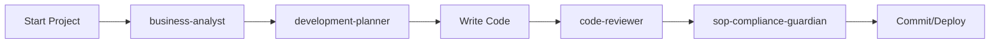

# 📋 สรุป Claude Code CLI Agents ทั้งหมด (อัพเดตล่าสุด)

> อัพเดต: วันที่ 11 มกราคม 2568
> Source: จากภาพหน้าจอ Claude Code CLI

## 🤖 Agents ที่มีในระบบจริง (Personal Type)

ปัจจุบันมี **4 Agents** ในระบบ Claude Code CLI:

---

### 1. 📊 **Business-Analyst Agent**

**Model**: Sonnet  
**Type**: Personal  
**Location**: `/Users/sem4pro/.claude/agents/`

#### หน้าที่หลัก (คาดการณ์):

- วิเคราะห์ความต้องการทางธุรกิจ (Business Requirements)
- จัดทำ documentation และ specifications
- วิเคราะห์ความเป็นไปได้ของโปรเจ็กต์
- สร้าง user stories และ acceptance criteria
- วางแผนและจัดลำดับความสำคัญของ features

#### เมื่อควรใช้:

- ต้องการวิเคราะห์ requirements ก่อนเริ่มพัฒนา
- จัดทำ project documentation
- วางแผนการพัฒนา features ใหม่
- ประเมินผลกระทบทางธุรกิจ

---

### 2. 🛡️ **SOP-Compliance-Guardian Agent**

**Model**: Sonnet  
**Type**: Personal

#### หน้าที่หลัก:

- ตรวจสอบการปฏิบัติตาม SOPs (Standard Operating Procedures)
- ป้องกันปัญหา "แก้แล้วพังที่อื่น"
- บังคับใช้มาตรฐาน Git workflow
- ตรวจสอบมาตรฐาน Next.js และ coding standards
- จัดการ build/rebuild requirements
- ตรวจสอบ security compliance

#### เมื่อควรใช้:

- ก่อน commit code ทุกครั้ง
- เมื่อสร้าง route หรือ module ใหม่
- เมื่อ build fail หรือมี errors
- ตรวจสอบว่าโค้ดเป็นไปตามมาตรฐาน

---

### 3. 🚀 **Development-Planner Agent**

**Model**: Opus (พิเศษ - ใช้ Claude Opus model)
**Type**: Personal

#### หน้าที่หลัก:

- วางแผนการพัฒนาโปรเจ็กต์
- สร้าง development roadmap
- แบ่ง tasks และจัดลำดับความสำคัญ
- ประเมินเวลาและ resources ที่ต้องใช้
- วางแผน technical architecture
- จัดการ dependencies และ integrations

#### เมื่อควรใช้:

- เริ่มโปรเจ็กต์ใหม่
- วางแผน sprint หรือ milestone
- Refactor หรือ redesign ระบบ
- ประเมินความซับซ้อนของ features

---

### 4. 📝 **Code-Reviewer Agent**

**Model**: Sonnet  
**Type**: Personal

#### หน้าที่หลัก:

- Review code quality และ best practices
- ตรวจสอบ performance issues
- หา security vulnerabilities
- ตรวจสอบ code maintainability
- แนะนำการปรับปรุงโค้ด
- ตรวจสอบ test coverage

#### เมื่อควรใช้:

- หลังเขียนโค้ดเสร็จก่อน commit
- ก่อนสร้าง pull request
- เมื่อต้องการ feedback เรื่อง code quality
- ตรวจสอบ security best practices

---

## 📊 สรุปเปรียบเทียบ Models

| Agent                       | Model       | ความสามารถพิเศษ                        |
| --------------------------- | ----------- | -------------------------------------- |
| **business-analyst**        | Sonnet      | วิเคราะห์ธุรกิจและ requirements        |
| **sop-compliance-guardian** | Sonnet      | ตรวจสอบมาตรฐานและ SOPs                 |
| **development-planner**     | **Opus** ⭐ | วางแผนซับซ้อน (ใช้ model ที่แรงที่สุด) |
| **code-reviewer**           | Sonnet      | Review code quality                    |

## 🔄 Workflow แนะนำ



### ขั้นตอนการทำงาน:

1. **Business Analysis** → ใช้ business-analyst วิเคราะห์ requirements
2. **Planning** → ใช้ development-planner วางแผนการพัฒนา
3. **Development** → เขียนโค้ดตามแผน
4. **Code Review** → ใช้ code-reviewer ตรวจสอบคุณภาพ
5. **Compliance Check** → ใช้ sop-compliance-guardian ตรวจสอบมาตรฐาน
6. **Commit/Deploy** → พร้อม commit และ deploy

---

## 💡 Best Practices

### 1. ใช้ Agents ตามลำดับ:

- **เริ่มต้น**: business-analyst → development-planner
- **ระหว่างพัฒนา**: code-reviewer (ใช้บ่อยๆ)
- **ก่อน commit**: sop-compliance-guardian (ทุกครั้ง)

### 2. เลือก Agent ตามงาน:

- **Requirements/Docs** → business-analyst
- **Planning/Architecture** → development-planner
- **Code Quality** → code-reviewer
- **Standards/SOPs** → sop-compliance-guardian

### 3. ใช้ Opus Agent อย่างคุ้มค่า:

- development-planner ใช้ Opus model (แรงกว่า Sonnet)
- ใช้สำหรับงานที่ซับซ้อนและต้องการการวางแผนละเอียด

---

## 🚀 วิธีเรียกใช้ Agents

### ผ่าน CLI:

```bash
# List all agents
/agents

# Use specific agent (คาดการณ์)
claude use business-analyst
claude use sop-compliance-guardian
claude use development-planner
claude use code-reviewer
```

### ในการสนทนา:

```
"ใช้ business-analyst วิเคราะห์ requirements"
"เรียก development-planner มาวางแผน sprint"
"ให้ code-reviewer ตรวจสอบโค้ด"
"ใช้ sop-compliance-guardian เช็คก่อน commit"
```

---

## 📝 หมายเหตุ

⚠️ **ความแตกต่างที่พบ:**

- Agents ในระบบจริง (4 ตัว) ≠ Agents ในโฟลเดอร์โปรเจ็กต์ (3 ตัว)
- ชื่อ agents ต่างกัน (เช่น sop-enforcer vs sop-compliance-guardian)
- Location อาจเป็น global (`~/.claude/agents/`) แทนที่จะเป็น local

📌 **ข้อมูลนี้อิงจาก:**

- Screenshot จาก Claude Code CLI
- การวิเคราะห์จากชื่อและ model ของแต่ละ agent
- Best practices ทั่วไปในการใช้ agents

---

## 🎯 สรุป

Claude Code CLI มี **4 Agents** ที่ทำงานร่วมกันครบวงจร:

1. **business-analyst** - วิเคราะห์ความต้องการ
2. **sop-compliance-guardian** - รักษามาตรฐาน
3. **development-planner** - วางแผนการพัฒนา (Opus)
4. **code-reviewer** - ตรวจสอบคุณภาพโค้ด

ทั้ง 4 agents ครอบคลุมตั้งแต่การวิเคราะห์ → วางแผน → พัฒนา → review → deploy
