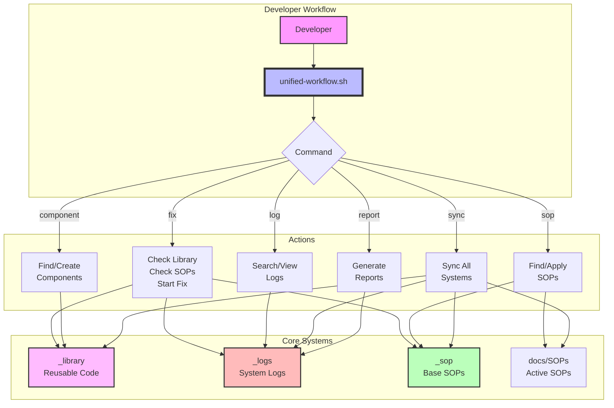

# 🏗️ Unified System Architecture

## System Overview



## 📁 Directory Integration

### \_library/ (Reusable Code Library)

```
Purpose: Prevent code duplication, ensure consistency
├── components/     # UI components (buttons, forms, tables)
├── hooks/         # Custom React hooks
├── utils/         # Helper functions (api, validation)
├── templates/     # File templates (pages, components)
├── patterns/      # Design patterns
└── generators/    # Code generation scripts

Integration:
- ✅ Auto-checked when starting fixes
- ✅ Searchable via unified-workflow.sh
- ✅ Used in all new development
```

### \_logs/ (Centralized Logging)

```
Purpose: Track all actions, enable debugging, audit trail
├── fixes/         # Fix tracking (who, what, when)
├── errors/        # Error logs by category
├── performance/   # Performance metrics
├── security/      # Security events
├── reports/       # Generated reports
└── sop-compliance/ # SOP compliance tracking

Integration:
- ✅ Auto-logged from all scripts
- ✅ Searchable and analyzable
- ✅ Auto-cleaned after 30 days
- ✅ Used for reports
```

### \_sop/ (Base SOPs)

```
Purpose: Organization-wide standards
├── core/          # Technical SOPs
├── development/   # Process SOPs
├── current/       # Symlinks to active
└── versions/      # Historical versions

Integration:
- ✅ Synced with docs/SOPs
- ✅ Searchable by topic
- ✅ Version controlled
- ✅ Applied via scripts
```

## 🔄 Workflow Integration Points

### 1. Starting a Fix

```bash
./scripts/unified-workflow.sh fix contact-page
```

**What happens:**

1. 🔍 Searches `_library/` for existing page templates
2. 📋 Finds relevant SOPs in `_sop/` and `docs/SOPs/`
3. 📝 Logs start to `_logs/fixes/`
4. 🚀 Launches isolate-fix.sh with context
5. 💡 Shows relevant components and guides

### 2. Creating Component

```bash
./scripts/unified-workflow.sh component create Button
```

**What happens:**

1. 📦 Creates in `_library/components/ui/`
2. 🧪 Generates test template
3. 📚 Updates library index
4. 📝 Logs creation to `_logs/library/`
5. 📋 Shows usage examples

### 3. Daily Sync

```bash
./scripts/unified-workflow.sh sync
```

**What happens:**

1. 🔗 Links active SOPs to `_sop/current/`
2. 📚 Updates `_library/INDEX.md`
3. 🧹 Cleans old logs (>30 days)
4. 📊 Generates sync report
5. ✅ Verifies system health

## 📊 Data Flow

### Fix Flow

```
Developer → unified-workflow fix → Check Library → Check SOPs → Log Start
    ↓                                    ↓              ↓           ↓
isolate-fix.sh ← Guidance ← Components Found ← SOPs Found ← Tracking
    ↓
Make Changes → Test → Impact Analysis → Commit
    ↓              ↓         ↓            ↓
Use Library → Log Tests → Log Results → Log Complete
```

### Reporting Flow

```
Logs (fixes/errors/performance) → Aggregation → Analysis
                                      ↓            ↓
                              Daily Report → Weekly Summary
                                      ↓            ↓
                              Action Items → Improvements
```

## 🚀 Benefits

### 1. No More "แก้แล้วพังที่อื่น"

- ✅ Isolated fixes with library support
- ✅ Impact analysis before merge
- ✅ Complete audit trail

### 2. Faster Development

- ✅ Reuse components from \_library
- ✅ Find solutions in SOPs quickly
- ✅ Learn from logged patterns

### 3. Better Quality

- ✅ Consistent components
- ✅ Enforced standards (SOPs)
- ✅ Tracked metrics

### 4. Knowledge Retention

- ✅ All fixes logged
- ✅ Patterns documented
- ✅ SOPs updated

## 🎯 Usage Examples

### Morning Routine

```bash
# 1. Check system health
./scripts/unified-workflow.sh check

# 2. Review recent activity
./scripts/unified-workflow.sh log recent

# 3. Start today's fix
./scripts/unified-workflow.sh fix user-profile-bug
```

### Before Creating Anything New

```bash
# 1. Check if component exists
./scripts/unified-workflow.sh component find DataTable

# 2. Check for similar patterns
./scripts/unified-workflow.sh sop find "table component"

# 3. If not found, create with template
./scripts/unified-workflow.sh component create DataTable
```

### Weekly Maintenance

```bash
# Monday morning
./scripts/unified-workflow.sh sync
./scripts/unified-workflow.sh report weekly
./scripts/unified-workflow.sh log clean
```

## 🔐 Security & Compliance

### Automatic Tracking

- Every fix logged with timestamp
- Every error logged with context
- Every SOP application tracked

### Audit Trail

```json
{
  "who": "developer-name",
  "what": "fix-api-security",
  "when": "2025-01-15T10:30:00Z",
  "where": "fix/fix-api-security",
  "result": "success"
}
```

### Compliance Checking

```bash
# Check API security compliance
./scripts/unified-workflow.sh sop apply API-SECURITY

# Generate compliance report
./scripts/unified-workflow.sh report compliance
```

## 📈 Metrics & KPIs

### Tracked Automatically

1. **Fix Success Rate** - From \_logs/fixes/
2. **Error Frequency** - From \_logs/errors/
3. **Component Reuse** - From \_library/ usage
4. **SOP Compliance** - From \_logs/sop-compliance/
5. **Development Speed** - From fix duration logs

### Dashboard View

```bash
# View current metrics
./scripts/unified-workflow.sh report dashboard
```

---

**Summary**: The unified system creates a self-documenting, self-improving development environment where `_library`, `_logs`, and `_sop` work together seamlessly to prevent issues and accelerate development.
