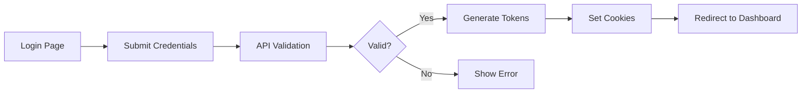

# Workflows & Use Cases

## Authentication Flow

### Login Process

### Token Refresh Flow
1. Access token expires (15 minutes)
2. Client sends refresh token
3. Server validates refresh token
4. New access token generated
5. Continue session seamlessly

## AI Assistant Workflow

### Conversation Lifecycle
1. User opens AI Assistant (/assistant)
2. New session ID generated (UUID format)
3. User sends message
4. Message saved to database
5. Claude API processes request
6. Response streamed back
7. Response saved to database
8. Conversation history updated
9. Cache updated for quick retrieval

### Message Processing
- Input validation
- Context window management
- Token counting
- Rate limiting check
- Claude API call
- Stream processing
- Error handling
- Response formatting

## Workspace Management Flow

### File Operations
1. User accesses workspace (/workspace)
2. File explorer loads directory structure
3. User performs CRUD operations on files
4. Changes persisted to filesystem
5. Git integration tracks changes
6. Real-time updates via WebSocket

### Project Management
- Create new project
- Load existing project
- Switch between projects
- Delete project
- Archive project
- Share project (planned)

## Terminal Workflow

### Session Creation
1. User opens terminal
2. Project path determined
3. WebSocket connection established
4. PTY process spawned
5. Shell initialized with environment
6. Session persisted to database

### Terminal Interaction
- Command input
- Output streaming
- Session persistence
- Background processing
- Tab management
- Split screen views

## Error Handling Patterns

### API Errors
- Standardized format: `{error: string, code: string}`
- HTTP status codes
- User-friendly messages
- Logging for debugging
- Retry mechanisms

### Database Failures
- Cache fallback
- In-memory storage
- Graceful degradation
- Auto-recovery
- User notification

### Network Errors
- Retry with exponential backoff
- Circuit breaker pattern
- Offline mode activation
- Queue for later sync
- User feedback