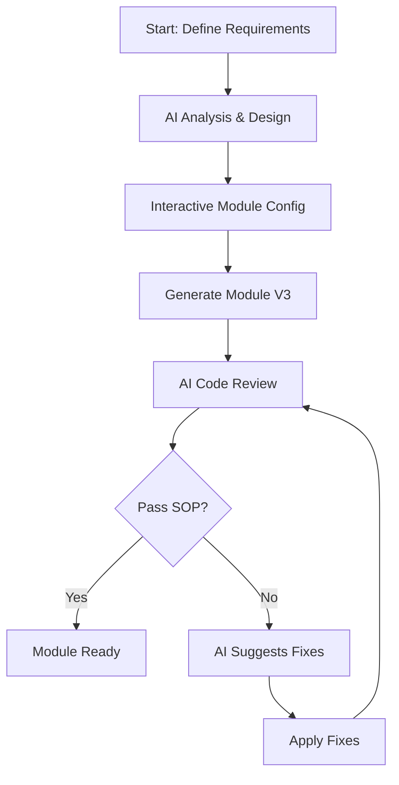

# SOP: Module Generator - Advanced Code Generation

## Overview

Module Generator V3 เป็นเครื่องมือ Enterprise-grade สำหรับสร้าง module ใหม่แบบอัตโนมัติ โดยบังคับให้ทุก module ที่สร้างขึ้นต้องปฏิบัติตาม SOP อย่างเคร่งครัด พร้อมระบบ logging, security, และ observability ในตัว

## วัตถุประสงค์

1. สร้าง module ที่มีคุณภาพสูงและปลอดภัย
2. บังคับใช้ best practices และ security standards (OWASP Top 10)
3. ลดเวลาในการพัฒนา module ใหม่
4. รักษา consistency ของ codebase
5. มีระบบ audit trail และ logging ในทุก module
6. รองรับ multi-tenancy และ enterprise features

## การใช้งาน

### 1. Module Generator V3 (แนะนำ)

```bash
# Interactive mode
npm run module:v3

# หรือ
npm run generate:module:v3

# ใช้ config file
npm run module:v3 config.json

# Dry run mode
npm run module:v3 -- --dry-run
```

### 2. Module Generator V2 (legacy)

```bash
npx tsx scripts/generate-module-v2.ts
```

## Module Generator V3 - คุณสมบัติใหม่

### 1. Module Logging System

ทุก module จะมีระบบ logging ในตัว:

- **Audit Trail**: บันทึกทุก CRUD operation (ใครทำอะไร เมื่อไหร่)
- **Error Logging**: บันทึก error พร้อม context
- **Performance Tracking**: วัดเวลาการทำงานของแต่ละ operation
- **Search Analytics**: track คำค้นหาและผลลัพธ์
- **Log Rotation**: ลบ log เก่าอัตโนมัติ

### 2. Security Features

- **OWASP Top 10 Compliance**: ป้องกัน SQL injection, XSS, CSRF
- **Rate Limiting**: จำกัดจำนวน request ด้วย token bucket
- **Multi-tenancy**: แยกข้อมูลตาม tenant อัตโนมัติ
- **Input Sanitization**: ทำความสะอาดข้อมูลก่อนบันทึก
- **Access Control**: ตรวจสอบสิทธิ์ในทุก operation

### 3. Enterprise Features

- **Caching Strategy**: cache-aside pattern พร้อม TTL
- **Background Jobs**: import/export ข้อมูลผ่าน BullMQ
- **Idempotency**: ป้องกันการทำซ้ำ
- **Observability**: metrics, tracing, audit logs
- **Policy Linter**: ตรวจสอบ code ตาม SOP อัตโนมัติ

## การใช้งาน Module Generator V3

### Interactive Configuration

เมื่อรัน `npm run module:v3` จะถามข้อมูลต่อไปนี้:

#### Basic Information

- **Module name**: ชื่อ module (kebab-case) เช่น `inventory-management`
- **Display name**: ชื่อที่แสดง เช่น `Inventory Management`
- **Description**: คำอธิบาย module

#### Security Configuration

- **Multi-tenancy**: เปิดใช้ multi-tenant support?
- **Authentication**: ต้องการ authentication?
- **Rate Limiting**: เปิดใช้ rate limit? (จำนวน requests/window)

#### Features Selection

- **CRUD Operations**: สร้าง Create, Read, Update, Delete
- **Search & Filter**: ระบบค้นหาและกรอง
- **Bulk Operations**: การทำงานแบบหลายรายการ
- **Import/Export**: นำเข้า/ส่งออกข้อมูล
- **Audit Trail**: บันทึกการเปลี่ยนแปลง
- **Caching**: ระบบ cache เพื่อ performance
- **Real-time Updates**: อัพเดตแบบ real-time
- **File Uploads**: อัพโหลดไฟล์
- **Notifications**: ระบบแจ้งเตือน
- **Workflow**: ระบบ workflow

#### Field Configuration

กำหนด fields ของ module:

- **Field name**: ชื่อ field
- **Field type**: string, text, number, boolean, date, json, enum, relation
- **Required**: บังคับหรือไม่
- **Unique**: ค่าไม่ซ้ำหรือไม่
- **Default value**: ค่า default
- **Description**: คำอธิบาย field

## โครงสร้างที่ถูกสร้าง (V3)

```
modules/[module-name]/
├── database/
│   ├── schema.prisma         # Prisma schema
│   ├── data-dictionary.md    # Data dictionary
│   └── migrations/          # Database migrations
├── services/
│   └── [module].service.ts  # Business logic พร้อม:
│       ├── Comprehensive logging
│       ├── Audit trail tracking
│       ├── Performance monitoring
│       ├── Multi-tenant support
│       └── Cache management
├── api/
│   ├── route.ts            # API routes (GET, POST)
│   └── [id]/
│       └── route.ts        # API routes (GET, PUT, DELETE)
├── logging/
│   └── index.ts           # Module-specific logger:
│       ├── CRUD operation logging
│       ├── Error tracking
│       ├── Performance metrics
│       └── Search analytics
├── logs/
│   ├── audit/             # Audit trail logs
│   ├── errors/            # Error logs
│   ├── performance/       # Performance logs
│   └── .gitignore         # Ignore log files
├── middleware/
│   ├── tenant-guard.ts    # Multi-tenant isolation
│   ├── rate-limiter.ts    # Rate limiting
│   └── idempotency.ts     # Prevent duplicates
├── caching/
│   └── strategy.ts        # Cache implementation
├── jobs/
│   └── import-export.ts   # Background jobs
├── observability/
│   └── index.ts          # Metrics & tracing
├── errors/
│   └── index.ts          # Custom error classes
├── hooks/
│   └── use[Module].ts    # React hooks
├── components/           # UI components
├── types/               # TypeScript types
├── validation/          # Zod schemas
├── constants/           # Module constants
├── config/              # Configuration
├── tests/
│   ├── unit/           # Unit tests
│   ├── integration/    # Integration tests
│   ├── e2e/           # End-to-end tests
│   ├── security/      # Security tests
│   └── performance/   # Performance tests
├── scripts/
│   ├── policy-linter.ts     # SOP compliance check
│   ├── log-analyzer.ts      # Log analysis tool
│   └── migration-safety.ts  # Migration validator
├── docs/
│   ├── README.md           # Module documentation
│   ├── API.md             # API documentation
│   └── compliance-report.md # SOP compliance
└── manifest.json          # Module manifest
```

## SOP Compliance ที่บังคับใช้

### 1. Security (บังคับทุก module)

- ✅ Input validation ด้วย Zod
- ✅ SQL injection prevention (Prisma)
- ✅ XSS prevention
- ✅ Authentication required
- ✅ Permission-based access control
- ✅ Sensitive data exclusion from logs
- ✅ Rate limiting ready

### 2. Error Handling (บังคับทุก module)

- ✅ Try-catch blocks ในทุก async function
- ✅ Structured error logging
- ✅ User-friendly error messages
- ✅ Proper HTTP status codes
- ✅ Validation error details

### 3. Performance (บังคับทุก module)

- ✅ Database query optimization
- ✅ Pagination implementation
- ✅ Caching strategy
- ✅ Parallel query execution
- ✅ Selective field loading

### 4. Code Quality (บังคับทุก module)

- ✅ TypeScript strict mode
- ✅ JSDoc comments
- ✅ Consistent naming
- ✅ DRY principle
- ✅ SOLID principles

### 5. Testing (optional แต่แนะนำ)

- ✅ Unit tests for services
- ✅ Mock implementations
- ✅ Error case testing
- ✅ Edge case handling

### 6. Documentation (บังคับทุก module)

- ✅ README.md
- ✅ Data dictionary
- ✅ API documentation
- ✅ SOP compliance checklist
- ✅ Usage examples

## ตัวอย่าง Generated Code

### Service Layer (พร้อม SOP compliance)

```typescript
async findAll(params: ProductListParams = {}) {
  // 1. Input validation
  if (page < 1 || limit < 1 || limit > 100) {
    throw new Error('Invalid pagination parameters')
  }

  // 2. Security - sanitize search input
  const where: Prisma.ProductWhereInput = {
    deletedAt: null,
    ...(search && {
      OR: [
        { name: { contains: sanitizeInput(search), mode: 'insensitive' } },
      ],
    }),
  }

  try {
    // 3. Performance - parallel queries
    const [data, total] = await Promise.all([
      prisma.product.findMany({
        where,
        skip: (page - 1) * limit,
        take: limit,
        orderBy: { [sortBy]: sortOrder },
      }),
      prisma.product.count({ where }),
    ])

    // 4. Caching
    await this.cache.set(cacheKey, result, 300)

    // 5. Logging
    logger.info('Product list fetched', {
      count: data.length,
      total,
      page,
    })

    return result
  } catch (error) {
    // 6. Error handling
    logger.error('Error fetching products', { error, params })
    throw new Error('Failed to fetch products')
  }
}
```

### API Route (พร้อม auth & validation)

```typescript
export const POST = withAuth(
  async (request: NextRequest) => {
    try {
      // 1. Logging
      logger.info("Creating product", { user: request.user.id });

      // 2. Input validation
      const validationResult = productCreateSchema.safeParse(body);
      if (!validationResult.success) {
        return NextResponse.json(
          {
            error: "Validation failed",
            details: validationResult.error.errors,
          },
          { status: 400 },
        );
      }

      // 3. Create with audit trail
      const result = await productService.create(
        validationResult.data,
        request.user.id,
      );

      return NextResponse.json(result, { status: 201 });
    } catch (error) {
      // 4. Error handling
      logger.error("Error creating product:", error);
      return NextResponse.json(
        { error: "Failed to create product" },
        { status: 500 },
      );
    }
  },
  { requirePermission: PRODUCT_PERMISSIONS.CREATE },
);
```

## Module Features ที่สามารถเลือกได้

### 1. CRUD Operations

- Create with validation
- Read with pagination
- Update with audit trail
- Soft delete

### 2. Search & Filter

- Full-text search
- Field-specific filters
- Date range filters
- Multiple sort options

### 3. Bulk Operations

- Bulk delete
- Bulk update
- Bulk import
- Transaction support

### 4. Import/Export

- CSV import
- Excel export
- JSON format
- Validation on import

### 5. Audit Trail

- Track all changes
- User attribution
- Change history
- Restore capability

### 6. Caching

- Redis integration
- Cache invalidation
- TTL management
- Performance boost

### 7. Real-time Updates

- WebSocket support
- Event broadcasting
- Live notifications
- Collaborative editing

### 8. File Uploads

- Image optimization
- Virus scanning
- Size limits
- Type validation

### 9. Notifications

- Email notifications
- In-app alerts
- Push notifications
- Notification preferences

### 10. Workflow

- Status management
- Approval process
- Task assignment
- Timeline tracking

## Best Practices

### 1. ก่อนสร้าง Module

- วางแผนโครงสร้างข้อมูล
- กำหนด business rules
- ออกแบบ permissions
- เตรียม test cases

### 2. หลังสร้าง Module

- Review generated code
- Run TypeScript check
- Test all endpoints
- Update main schema.prisma
- Add permissions to RBAC

### 3. Maintenance

- Update dependencies
- Monitor performance
- Review security
- Update documentation

## Troubleshooting

### Error: Module already exists

- ลบ folder เดิมก่อน หรือใช้ชื่ออื่น

### Error: Invalid field type

- ตรวจสอบ field types ที่รองรับ

### Error: Prisma generation failed

- ตรวจสอบ syntax ใน schema.prisma
- รัน `npx prisma format`

## Advanced Usage

### Custom Templates

สามารถแก้ไข templates ใน `scripts/generate-module-v2.ts`:

- เพิ่ม custom logic
- ปรับ naming conventions
- เพิ่ม integrations

### Module Composition

สามารถสร้าง composite modules:

```bash
# สร้าง base module
npm run generate:module # product

# สร้าง related modules
npm run generate:module # product-category
npm run generate:module # product-review
```

## ผลลัพธ์ที่คาดหวัง

หลังจากรัน generator จะได้:

1. ✅ Module ที่พร้อมใช้งานทันที
2. ✅ Code ที่ปฏิบัติตาม SOP 100%
3. ✅ Documentation ครบถ้วน
4. ✅ Security built-in
5. ✅ Performance optimized
6. ✅ Test coverage
7. ✅ Type safety

## Integration กับ UNIFIED-SYSTEM Workflow

### การใช้งานร่วมกับ AI Assistant

1. **ขั้นตอนการออกแบบ Module กับ AI**

   ```bash
   # 1. ปรึกษา AI เพื่อออกแบบ module
   ./u "ช่วยออกแบบ module สำหรับจัดการสินค้าคงคลัง"

   # 2. AI จะช่วยวิเคราะห์และแนะนำ:
   - โครงสร้างข้อมูล
   - Features ที่ควรมี
   - Security requirements
   - Performance considerations
   ```

2. **สร้าง Module Configuration**

   ```json
   {
     "name": "inventory-management",
     "displayName": "Inventory Management",
     "multiTenant": true,
     "security": {
       "authentication": true,
       "rateLimit": { "enabled": true, "requests": 100, "window": "1m" }
     },
     "features": {
       "importExport": true,
       "bulkOperations": true,
       "softDelete": true,
       "search": true
     }
   }
   ```

3. **Generate Module**

   ```bash
   # รัน generator ด้วย config
   npm run module:v3 inventory-config.json
   ```

4. **AI Review และ Enhancement**

   ```bash
   # ให้ AI review code ที่ generate
   ./u "review module ที่เพิ่งสร้างใน src/modules/inventory-management"

   # AI จะตรวจสอบ:
   - SOP compliance
   - Security vulnerabilities
   - Performance optimizations
   - Missing features
   ```

### Workflow แบบ Interactive



### Best Practices สำหรับ AI Collaboration

1. **Pre-Generation**
   - ให้ AI ช่วยวิเคราะห์ requirements
   - ออกแบบ data schema ร่วมกับ AI
   - วางแผน security และ permissions

2. **During Generation**
   - ใช้ dry-run mode ดู output ก่อน
   - ให้ AI review configuration

3. **Post-Generation**
   - ให้ AI run policy linter
   - ตรวจสอบ test coverage
   - Review performance implications

## Log Analysis และ Monitoring

### วิเคราะห์ Log ด้วย AI

```bash
# วิเคราะห์ log
npx tsx src/modules/[module]/scripts/log-analyzer.ts

# ส่งผลให้ AI วิเคราะห์
./u "วิเคราะห์ผลจาก log analyzer และแนะนำการปรับปรุง"
```

### การตั้ง Alert Rules

```bash
# AI ช่วยสร้าง alert rules
./u "สร้าง alert rules สำหรับ inventory module based on log patterns"
```

## Version History

- v3.0.0 - Enterprise-grade with logging, multi-tenancy, and AI integration
- v2.0.0 - Enhanced with full SOP compliance
- v1.0.0 - Basic module generation
