# Data Flow Patterns

## Stock Portfolio Management System v3.0

### Document Information

- **Version**: 1.0
- **Date**: 2025-08-15
- **Agent**: System Analyst
- **Project**: Stock Portfolio Management System v3.0
- **Document Type**: Data Flow Architecture
- **Status**: Final
- **Dependencies**: UI-API Integration Plan, State Management Plan, React Hooks Plan

---

## Executive Summary

This document defines the data flow patterns for all major use cases in the Stock Portfolio Management System. It illustrates how data moves between the frontend UI components, state management layers, API services, and real-time WebSocket connections.

### Key Data Flow Principles

- **Unidirectional Data Flow**: Data flows from API → Store → Components
- **Real-time Synchronization**: WebSocket updates trigger state invalidation
- **Optimistic Updates**: Immediate UI feedback with automatic rollback
- **Cache-First Strategy**: React Query provides intelligent caching
- **Error Propagation**: Errors bubble up through the data flow layers
- **Type Safety**: End-to-end TypeScript ensures data integrity

---

## Data Flow Architecture Overview

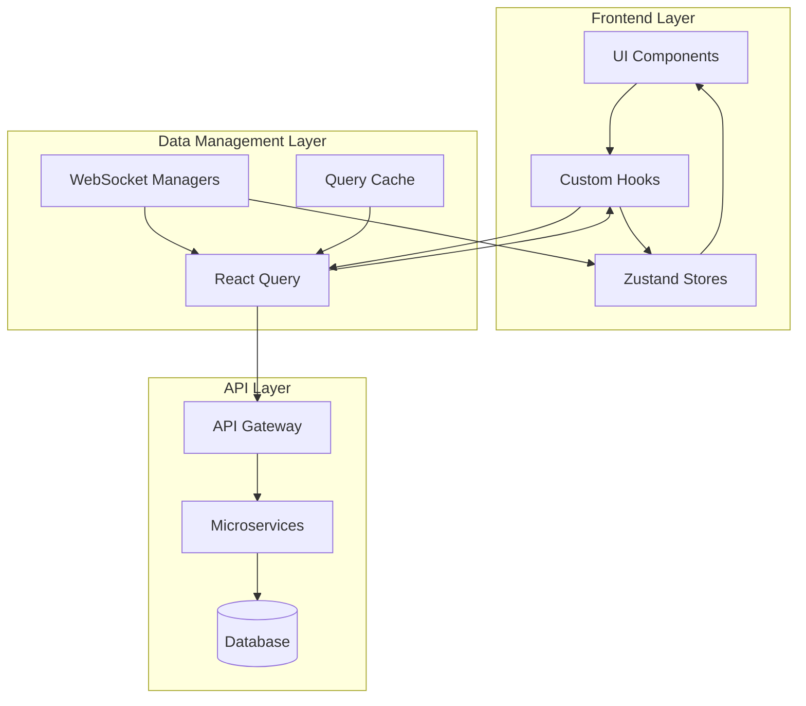
```mermaid
graph TB
    subgraph "Frontend Layer"
        UI[UI Components]
        Hooks[Custom Hooks]
        Store[Zustand Stores]
    end

    subgraph "Data Management Layer"
        RQ[React Query]
        WS[WebSocket Managers]
        Cache[Query Cache]
    end

    subgraph "API Layer"
        Gateway[API Gateway]
        Services[Microservices]
        DB[(Database)]
    end

    UI --> Hooks
    Hooks --> Store
    Hooks --> RQ
    RQ --> Gateway
    WS --> Store
    WS --> RQ
    Gateway --> Services
    Services --> DB

    Store --> UI
    RQ --> Hooks
    Cache --> RQ
```

---

## Authentication Flow

### Login Process

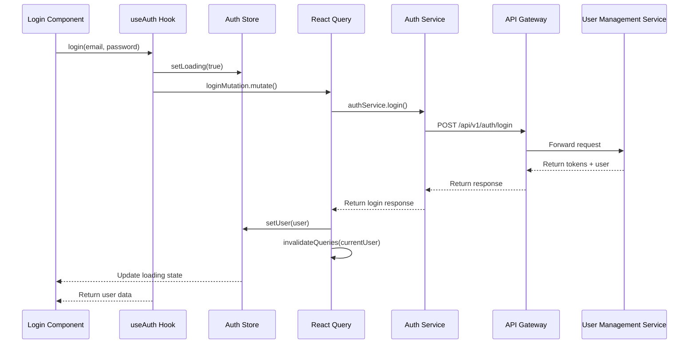
```mermaid
sequenceDiagram
    participant UI as Login Component
    participant Hook as useAuth Hook
    participant Store as Auth Store
    participant RQ as React Query
    participant API as Auth Service
    participant Gateway as API Gateway
    participant UMS as User Management Service

    UI->>Hook: login(email, password)
    Hook->>Store: setLoading(true)
    Hook->>RQ: loginMutation.mutate()
    RQ->>API: authService.login()
    API->>Gateway: POST /api/v1/auth/login
    Gateway->>UMS: Forward request
    UMS-->>Gateway: Return tokens + user
    Gateway-->>API: Return response
    API-->>RQ: Return login response
    RQ->>Store: setUser(user)
    RQ->>RQ: invalidateQueries(currentUser)
    Store-->>UI: Update loading state
    Hook-->>UI: Return user data
```

### Token Refresh Flow

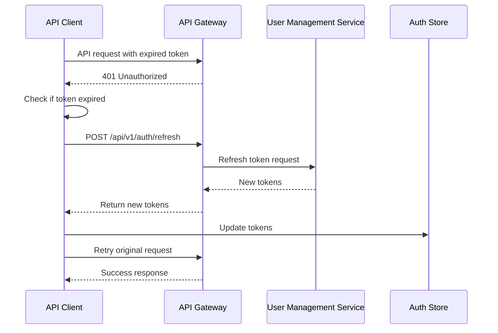
```mermaid
sequenceDiagram
    participant API as API Client
    participant Gateway as API Gateway
    participant UMS as User Management Service
    participant Store as Auth Store

    API->>Gateway: API request with expired token
    Gateway-->>API: 401 Unauthorized
    API->>API: Check if token expired
    API->>Gateway: POST /api/v1/auth/refresh
    Gateway->>UMS: Refresh token request
    UMS-->>Gateway: New tokens
    Gateway-->>API: Return new tokens
    API->>Store: Update tokens
    API->>Gateway: Retry original request
    Gateway-->>API: Success response
```

---

## Portfolio Management Flow

### Portfolio Data Loading

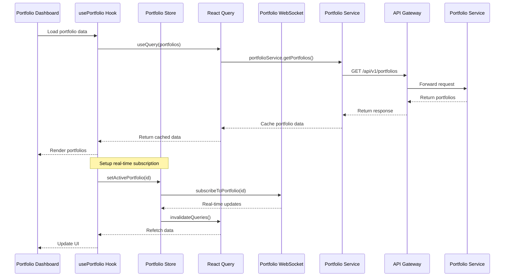
```mermaid
sequenceDiagram
    participant UI as Portfolio Dashboard
    participant Hook as usePortfolio Hook
    participant Store as Portfolio Store
    participant RQ as React Query
    participant WS as Portfolio WebSocket
    participant API as Portfolio Service
    participant Gateway as API Gateway
    participant PS as Portfolio Service

    UI->>Hook: Load portfolio data
    Hook->>RQ: useQuery(portfolios)
    RQ->>API: portfolioService.getPortfolios()
    API->>Gateway: GET /api/v1/portfolios
    Gateway->>PS: Forward request
    PS-->>Gateway: Return portfolios
    Gateway-->>API: Return response
    API-->>RQ: Cache portfolio data
    RQ-->>Hook: Return cached data
    Hook-->>UI: Render portfolios

    Note over Hook,Store: Setup real-time subscription
    Hook->>Store: setActivePortfolio(id)
    Store->>WS: subscribeToPortfolio(id)
    WS-->>Store: Real-time updates
    Store->>RQ: invalidateQueries()
    RQ-->>Hook: Refetch data
    Hook-->>UI: Update UI
```

### Trade Execution Flow

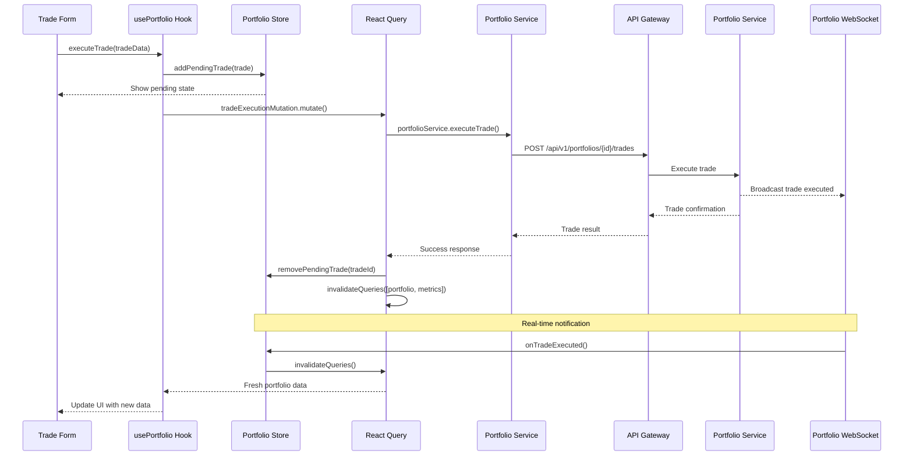
```mermaid
sequenceDiagram
    participant UI as Trade Form
    participant Hook as usePortfolio Hook
    participant Store as Portfolio Store
    participant RQ as React Query
    participant API as Portfolio Service
    participant Gateway as API Gateway
    participant PS as Portfolio Service
    participant WS as Portfolio WebSocket

    UI->>Hook: executeTrade(tradeData)
    Hook->>Store: addPendingTrade(trade)
    Store-->>UI: Show pending state
    Hook->>RQ: tradeExecutionMutation.mutate()
    RQ->>API: portfolioService.executeTrade()
    API->>Gateway: POST /api/v1/portfolios/{id}/trades
    Gateway->>PS: Execute trade
    PS-->>WS: Broadcast trade executed
    PS-->>Gateway: Trade confirmation
    Gateway-->>API: Trade result
    API-->>RQ: Success response
    RQ->>Store: removePendingTrade(tradeId)
    RQ->>RQ: invalidateQueries([portfolio, metrics])

    Note over WS,Store: Real-time notification
    WS->>Store: onTradeExecuted()
    Store->>RQ: invalidateQueries()
    RQ-->>Hook: Fresh portfolio data
    Hook-->>UI: Update UI with new data
```

---

## Real-time Stock Prices Flow

### Price Subscription & Updates

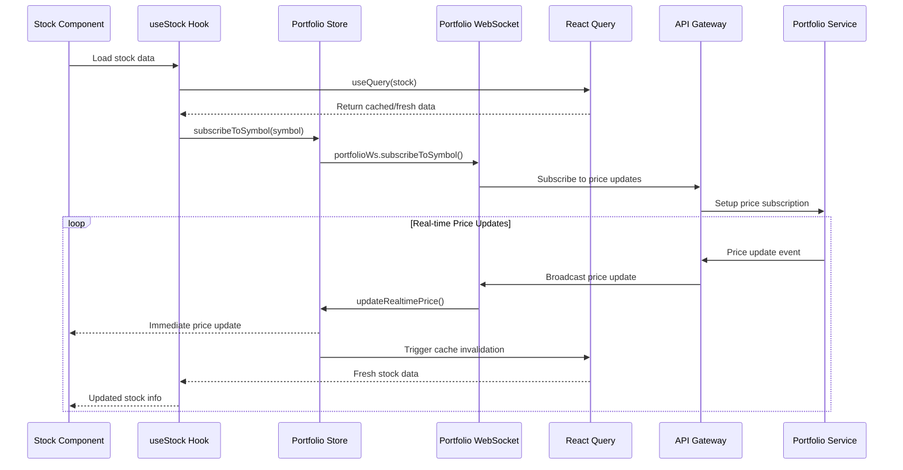
```mermaid
sequenceDiagram
    participant UI as Stock Component
    participant Hook as useStock Hook
    participant Store as Portfolio Store
    participant WS as Portfolio WebSocket
    participant RQ as React Query
    participant Gateway as API Gateway
    participant PS as Portfolio Service

    UI->>Hook: Load stock data
    Hook->>RQ: useQuery(stock)
    RQ-->>Hook: Return cached/fresh data
    Hook->>Store: subscribeToSymbol(symbol)
    Store->>WS: portfolioWs.subscribeToSymbol()
    WS->>Gateway: Subscribe to price updates
    Gateway->>PS: Setup price subscription

    loop Real-time Price Updates
        PS->>Gateway: Price update event
        Gateway->>WS: Broadcast price update
        WS->>Store: updateRealtimePrice()
        Store-->>UI: Immediate price update
        Store->>RQ: Trigger cache invalidation
        RQ-->>Hook: Fresh stock data
        Hook-->>UI: Updated stock info
    end
```

---

## AI Chat Flow

### Message Streaming Flow

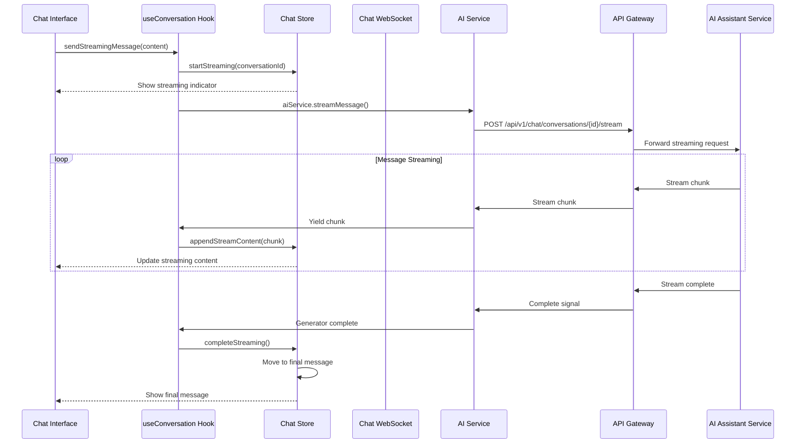
```mermaid
sequenceDiagram
    participant UI as Chat Interface
    participant Hook as useConversation Hook
    participant Store as Chat Store
    participant WS as Chat WebSocket
    participant API as AI Service
    participant Gateway as API Gateway
    participant AIS as AI Assistant Service

    UI->>Hook: sendStreamingMessage(content)
    Hook->>Store: startStreaming(conversationId)
    Store-->>UI: Show streaming indicator
    Hook->>API: aiService.streamMessage()
    API->>Gateway: POST /api/v1/chat/conversations/{id}/stream
    Gateway->>AIS: Forward streaming request

    loop Message Streaming
        AIS->>Gateway: Stream chunk
        Gateway->>API: Stream chunk
        API->>Hook: Yield chunk
        Hook->>Store: appendStreamContent(chunk)
        Store-->>UI: Update streaming content
    end

    AIS->>Gateway: Stream complete
    Gateway->>API: Complete signal
    API->>Hook: Generator complete
    Hook->>Store: completeStreaming()
    Store->>Store: Move to final message
    Store-->>UI: Show final message
```

### Conversation Management Flow

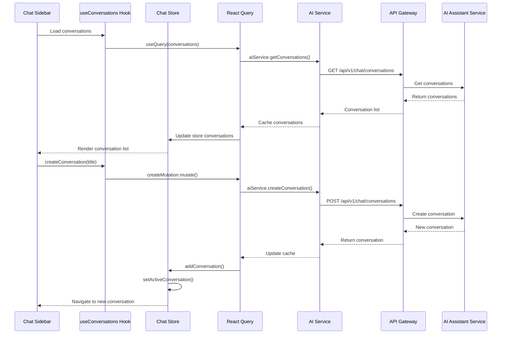
```mermaid
sequenceDiagram
    participant UI as Chat Sidebar
    participant Hook as useConversations Hook
    participant Store as Chat Store
    participant RQ as React Query
    participant API as AI Service
    participant Gateway as API Gateway
    participant AIS as AI Assistant Service

    UI->>Hook: Load conversations
    Hook->>RQ: useQuery(conversations)
    RQ->>API: aiService.getConversations()
    API->>Gateway: GET /api/v1/chat/conversations
    Gateway->>AIS: Get conversations
    AIS-->>Gateway: Return conversations
    Gateway-->>API: Conversation list
    API-->>RQ: Cache conversations
    RQ->>Store: Update store conversations
    Store-->>UI: Render conversation list

    UI->>Hook: createConversation(title)
    Hook->>RQ: createMutation.mutate()
    RQ->>API: aiService.createConversation()
    API->>Gateway: POST /api/v1/chat/conversations
    Gateway->>AIS: Create conversation
    AIS-->>Gateway: New conversation
    Gateway-->>API: Return conversation
    API-->>RQ: Update cache
    RQ->>Store: addConversation()
    Store->>Store: setActiveConversation()
    Store-->>UI: Navigate to new conversation
```

---

## Terminal Operations Flow

### Terminal Session Creation

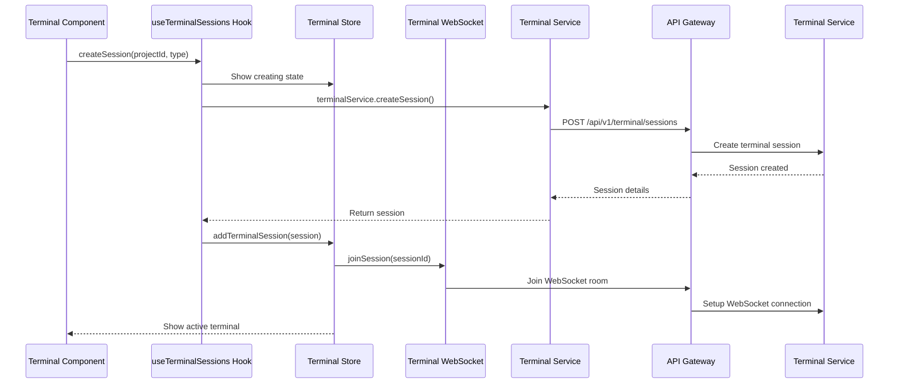
```mermaid
sequenceDiagram
    participant UI as Terminal Component
    participant Hook as useTerminalSessions Hook
    participant Store as Terminal Store
    participant WS as Terminal WebSocket
    participant API as Terminal Service
    participant Gateway as API Gateway
    participant TS as Terminal Service

    UI->>Hook: createSession(projectId, type)
    Hook->>Store: Show creating state
    Hook->>API: terminalService.createSession()
    API->>Gateway: POST /api/v1/terminal/sessions
    Gateway->>TS: Create terminal session
    TS-->>Gateway: Session created
    Gateway-->>API: Session details
    API-->>Hook: Return session
    Hook->>Store: addTerminalSession(session)
    Store->>WS: joinSession(sessionId)
    WS->>Gateway: Join WebSocket room
    Gateway->>TS: Setup WebSocket connection
    Store-->>UI: Show active terminal
```

### Terminal I/O Flow

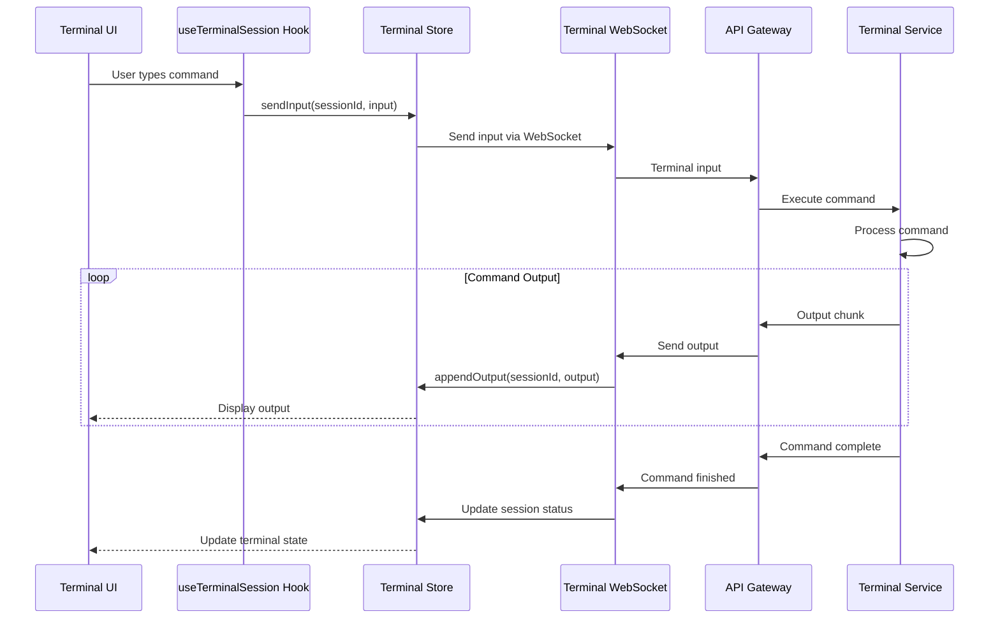
```mermaid
sequenceDiagram
    participant UI as Terminal UI
    participant Hook as useTerminalSession Hook
    participant Store as Terminal Store
    participant WS as Terminal WebSocket
    participant Gateway as API Gateway
    participant TS as Terminal Service

    UI->>Hook: User types command
    Hook->>Store: sendInput(sessionId, input)
    Store->>WS: Send input via WebSocket
    WS->>Gateway: Terminal input
    Gateway->>TS: Execute command
    TS->>TS: Process command

    loop Command Output
        TS->>Gateway: Output chunk
        Gateway->>WS: Send output
        WS->>Store: appendOutput(sessionId, output)
        Store-->>UI: Display output
    end

    TS->>Gateway: Command complete
    Gateway->>WS: Command finished
    WS->>Store: Update session status
    Store-->>UI: Update terminal state
```

---

## Workspace File Operations Flow

### File System Navigation

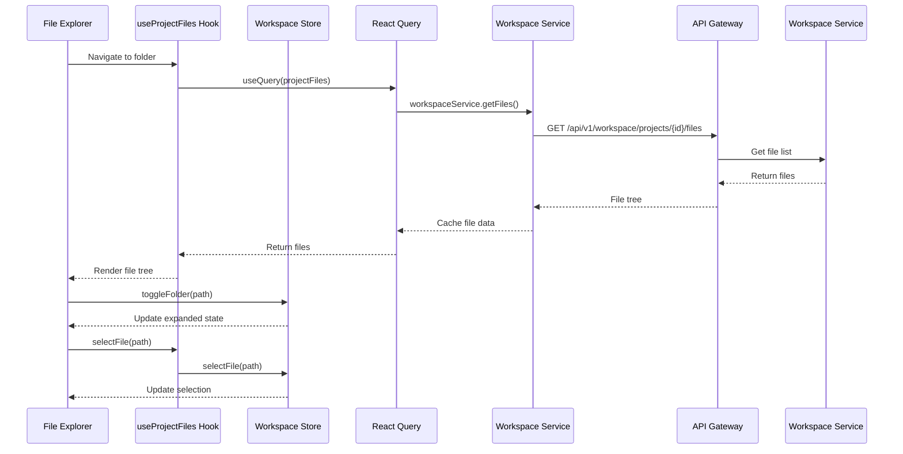
```mermaid
sequenceDiagram
    participant UI as File Explorer
    participant Hook as useProjectFiles Hook
    participant Store as Workspace Store
    participant RQ as React Query
    participant API as Workspace Service
    participant Gateway as API Gateway
    participant WS as Workspace Service

    UI->>Hook: Navigate to folder
    Hook->>RQ: useQuery(projectFiles)
    RQ->>API: workspaceService.getFiles()
    API->>Gateway: GET /api/v1/workspace/projects/{id}/files
    Gateway->>WS: Get file list
    WS-->>Gateway: Return files
    Gateway-->>API: File tree
    API-->>RQ: Cache file data
    RQ-->>Hook: Return files
    Hook-->>UI: Render file tree

    UI->>Store: toggleFolder(path)
    Store-->>UI: Update expanded state

    UI->>Hook: selectFile(path)
    Hook->>Store: selectFile(path)
    Store-->>UI: Update selection
```

### File Content Editing

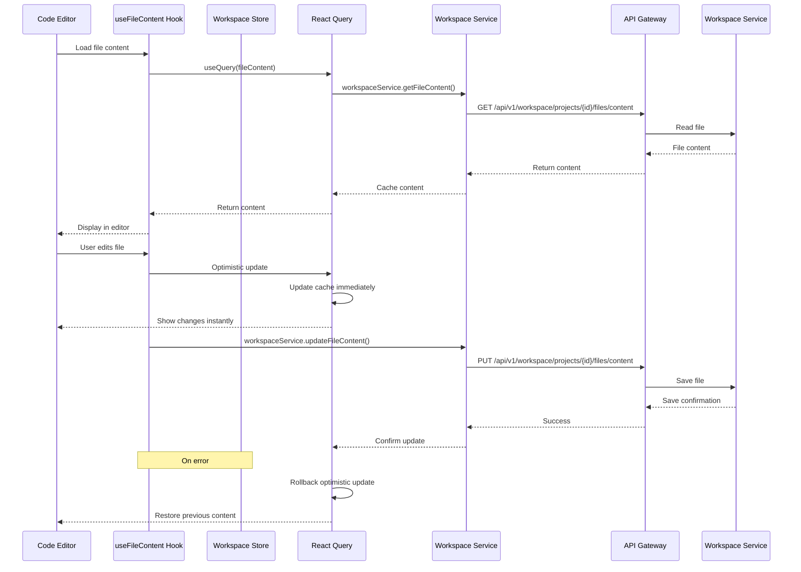
```mermaid
sequenceDiagram
    participant UI as Code Editor
    participant Hook as useFileContent Hook
    participant Store as Workspace Store
    participant RQ as React Query
    participant API as Workspace Service
    participant Gateway as API Gateway
    participant WS as Workspace Service

    UI->>Hook: Load file content
    Hook->>RQ: useQuery(fileContent)
    RQ->>API: workspaceService.getFileContent()
    API->>Gateway: GET /api/v1/workspace/projects/{id}/files/content
    Gateway->>WS: Read file
    WS-->>Gateway: File content
    Gateway-->>API: Return content
    API-->>RQ: Cache content
    RQ-->>Hook: Return content
    Hook-->>UI: Display in editor

    UI->>Hook: User edits file
    Hook->>RQ: Optimistic update
    RQ->>RQ: Update cache immediately
    RQ-->>UI: Show changes instantly
    Hook->>API: workspaceService.updateFileContent()
    API->>Gateway: PUT /api/v1/workspace/projects/{id}/files/content
    Gateway->>WS: Save file
    WS-->>Gateway: Save confirmation
    Gateway-->>API: Success
    API-->>RQ: Confirm update

    Note over Hook,Store: On error
    RQ->>RQ: Rollback optimistic update
    RQ-->>UI: Restore previous content
```

---

## Error Handling Flow

### API Error Propagation

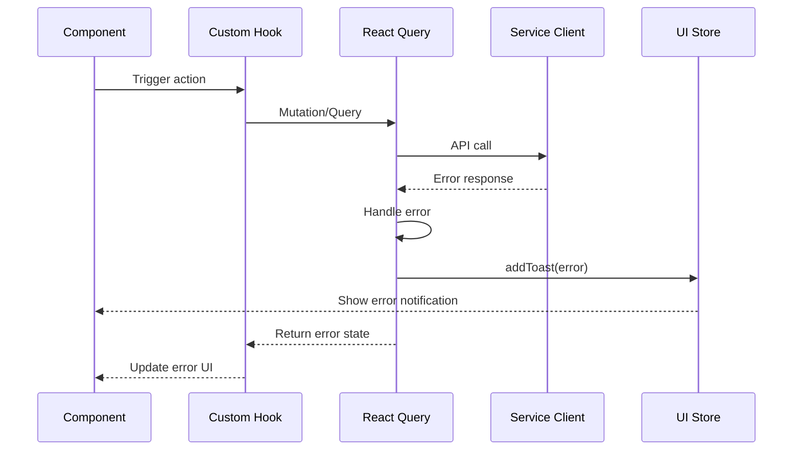
```mermaid
sequenceDiagram
    participant UI as Component
    participant Hook as Custom Hook
    participant RQ as React Query
    participant API as Service Client
    participant Store as UI Store

    UI->>Hook: Trigger action
    Hook->>RQ: Mutation/Query
    RQ->>API: API call
    API-->>RQ: Error response
    RQ->>RQ: Handle error
    RQ->>Store: addToast(error)
    Store-->>UI: Show error notification
    RQ-->>Hook: Return error state
    Hook-->>UI: Update error UI
```

### Network Error Recovery

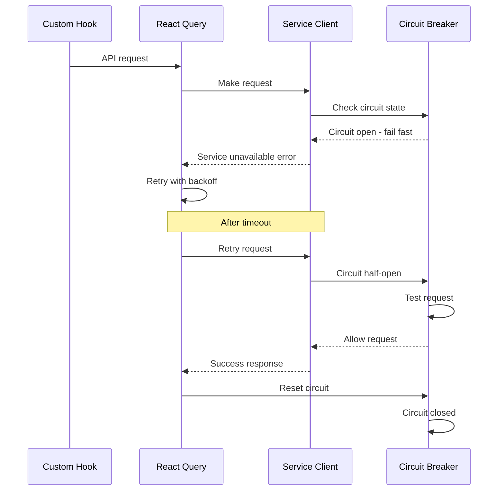
```mermaid
sequenceDiagram
    participant Hook as Custom Hook
    participant RQ as React Query
    participant API as Service Client
    participant CB as Circuit Breaker

    Hook->>RQ: API request
    RQ->>API: Make request
    API->>CB: Check circuit state
    CB-->>API: Circuit open - fail fast
    API-->>RQ: Service unavailable error
    RQ->>RQ: Retry with backoff

    Note over RQ,API: After timeout
    RQ->>API: Retry request
    API->>CB: Circuit half-open
    CB->>CB: Test request
    CB-->>API: Allow request
    API-->>RQ: Success response
    RQ->>CB: Reset circuit
    CB->>CB: Circuit closed
```

---

## WebSocket Reconnection Flow

### Connection Recovery

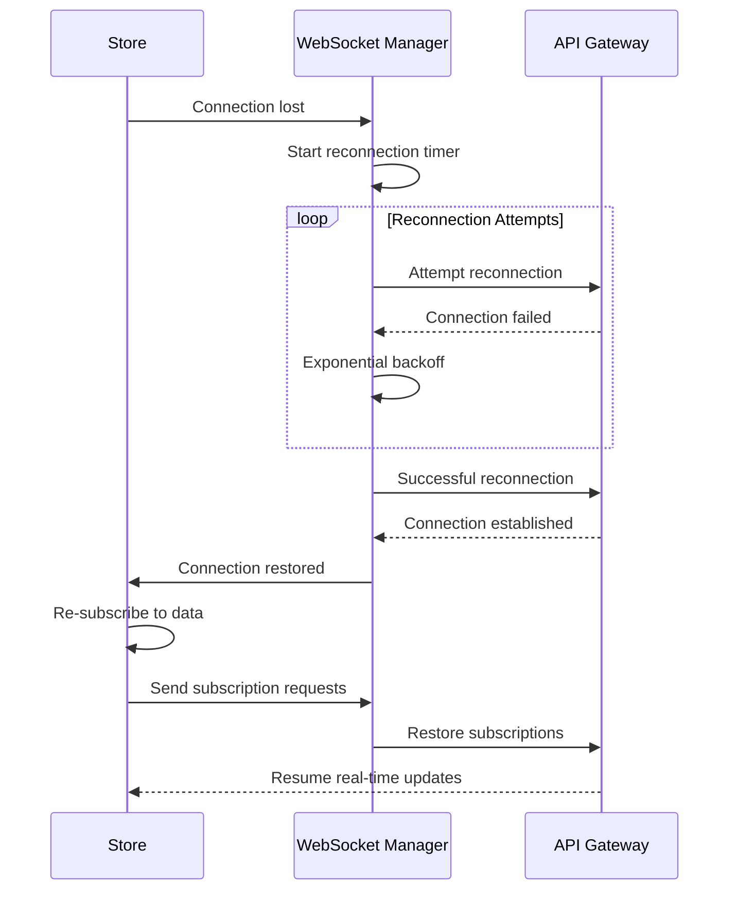
```mermaid
sequenceDiagram
    participant Store as Store
    participant WS as WebSocket Manager
    participant Gateway as API Gateway

    Store->>WS: Connection lost
    WS->>WS: Start reconnection timer

    loop Reconnection Attempts
        WS->>Gateway: Attempt reconnection
        Gateway-->>WS: Connection failed
        WS->>WS: Exponential backoff
    end

    WS->>Gateway: Successful reconnection
    Gateway-->>WS: Connection established
    WS->>Store: Connection restored
    Store->>Store: Re-subscribe to data
    Store->>WS: Send subscription requests
    WS->>Gateway: Restore subscriptions
    Gateway-->>Store: Resume real-time updates
```

---

## Performance Optimization Patterns

### Data Prefetching

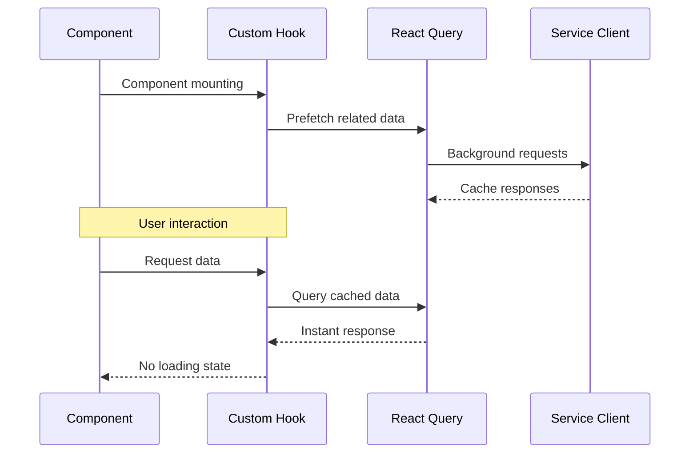
```mermaid
sequenceDiagram
    participant UI as Component
    participant Hook as Custom Hook
    participant RQ as React Query
    participant API as Service Client

    UI->>Hook: Component mounting
    Hook->>RQ: Prefetch related data
    RQ->>API: Background requests
    API-->>RQ: Cache responses

    Note over UI,Hook: User interaction
    UI->>Hook: Request data
    Hook->>RQ: Query cached data
    RQ-->>Hook: Instant response
    Hook-->>UI: No loading state
```

### Selective Invalidation

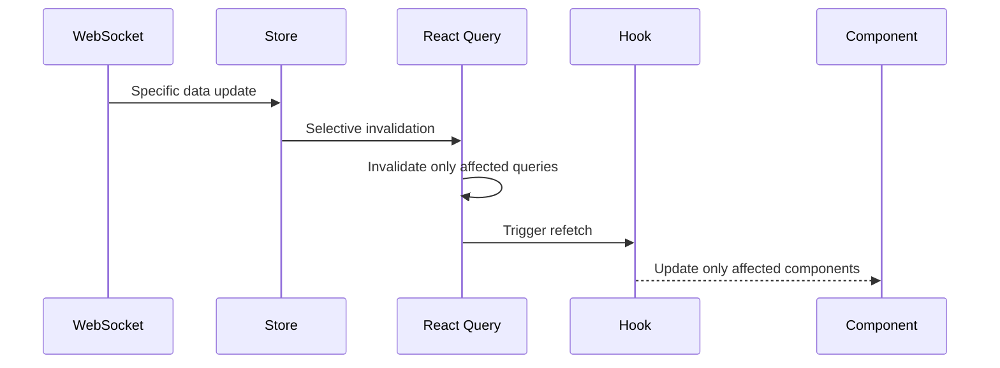
```mermaid
sequenceDiagram
    participant WS as WebSocket
    participant Store as Store
    participant RQ as React Query
    participant Hook as Hook
    participant UI as Component

    WS->>Store: Specific data update
    Store->>RQ: Selective invalidation
    RQ->>RQ: Invalidate only affected queries
    RQ->>Hook: Trigger refetch
    Hook-->>UI: Update only affected components
```

---

## Data Synchronization Patterns

### Optimistic Updates with Rollback

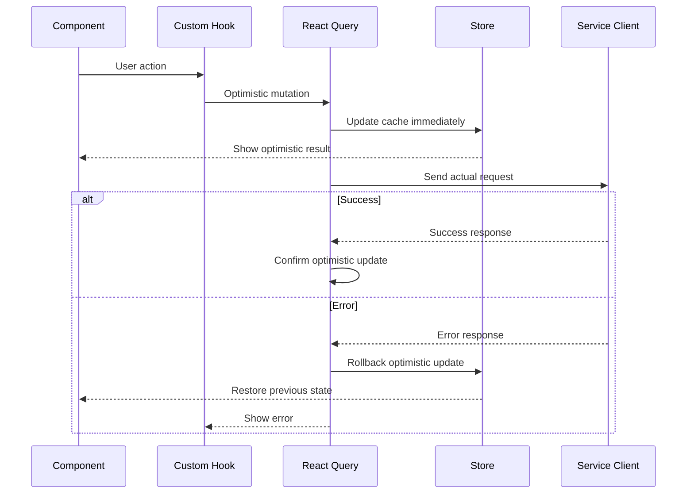
```mermaid
sequenceDiagram
    participant UI as Component
    participant Hook as Custom Hook
    participant RQ as React Query
    participant Store as Store
    participant API as Service Client

    UI->>Hook: User action
    Hook->>RQ: Optimistic mutation
    RQ->>Store: Update cache immediately
    Store-->>UI: Show optimistic result
    RQ->>API: Send actual request

    alt Success
        API-->>RQ: Success response
        RQ->>RQ: Confirm optimistic update
    else Error
        API-->>RQ: Error response
        RQ->>Store: Rollback optimistic update
        Store-->>UI: Restore previous state
        RQ-->>Hook: Show error
    end
```

### Real-time State Reconciliation

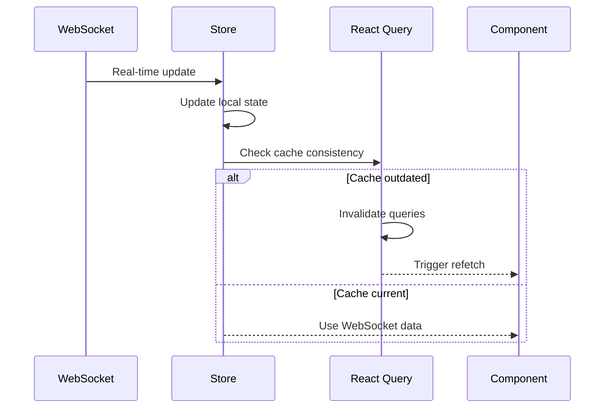
```mermaid
sequenceDiagram
    participant WS as WebSocket
    participant Store as Store
    participant RQ as React Query
    participant UI as Component

    WS->>Store: Real-time update
    Store->>Store: Update local state
    Store->>RQ: Check cache consistency

    alt Cache outdated
        RQ->>RQ: Invalidate queries
        RQ-->>UI: Trigger refetch
    else Cache current
        Store-->>UI: Use WebSocket data
    end
```

---

This comprehensive data flow documentation ensures that all team members understand how data moves through the system, enabling efficient development and debugging of the UI-API integration.
