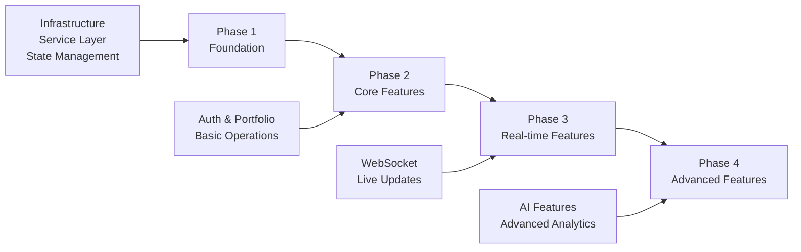

# Migration Plan: Mock Data to Real APIs

## Stock Portfolio Management System v3.0

### Document Information

- **Version**: 1.0
- **Date**: 2025-08-15
- **Agent**: System Analyst
- **Project**: Stock Portfolio Management System v3.0
- **Document Type**: Migration Strategy
- **Status**: Final
- **Dependencies**: All UI-API Integration documents

---

## Executive Summary

This document outlines the phased migration strategy from mock data to live API integration. The migration follows a systematic approach to minimize risk, ensure stability, and provide continuous value delivery throughout the transition process.

### Migration Objectives

- **Zero Downtime**: Seamless transition without service interruption
- **Incremental Delivery**: Phased rollout with immediate value
- **Risk Mitigation**: Comprehensive testing and rollback procedures
- **Performance Monitoring**: Real-time performance tracking during migration
- **User Experience**: Maintain or improve UX throughout migration
- **Data Integrity**: Ensure accurate data synchronization

---

## Migration Strategy Overview

### 4-Phase Migration Approach



### Migration Principles

- **Backward Compatibility**: Mock data remains available during transition
- **Feature Flags**: Toggle between mock and real data per feature
- **Progressive Enhancement**: Add API features without removing mock fallbacks
- **Performance First**: Monitor and optimize at each phase
- **User-Centric**: Prioritize features with highest user impact

---

## Pre-Migration Assessment

### Current State Analysis

```typescript
// Current Mock Data Infrastructure
interface MockDataState {
  portfolios: {
    implementation: "static-json";
    updateMechanism: "manual";
    realTimeSupport: false;
    dataConsistency: "basic";
  };

  stocks: {
    implementation: "static-data";
    priceUpdates: "simulated";
    realTimeSupport: "mock-websocket";
    marketData: "limited";
  };

  aiChat: {
    implementation: "mock-responses";
    streaming: false;
    contextAwareness: false;
    modelSupport: "basic";
  };

  terminal: {
    implementation: "local-only";
    projectIntegration: false;
    persistence: false;
    realTimeSync: false;
  };

  workspace: {
    implementation: "client-side";
    fileOperations: "browser-storage";
    gitIntegration: false;
    collaboration: false;
  };
}
```

### Target State Definition

```typescript
// Target API-Integrated State
interface TargetApiState {
  portfolios: {
    implementation: "microservice-api";
    updateMechanism: "real-time-websocket";
    realTimeSupport: true;
    dataConsistency: "strong";
    persistence: "database";
  };

  stocks: {
    implementation: "market-data-api";
    priceUpdates: "real-time-feed";
    realTimeSupport: "live-websocket";
    marketData: "comprehensive";
    historicalData: true;
  };

  aiChat: {
    implementation: "claude-api-integration";
    streaming: true;
    contextAwareness: true;
    modelSupport: "full-claude-suite";
    conversationPersistence: true;
  };

  terminal: {
    implementation: "microservice-backend";
    projectIntegration: true;
    persistence: true;
    realTimeSync: true;
    multiUserSupport: true;
  };

  workspace: {
    implementation: "cloud-backend";
    fileOperations: "real-filesystem";
    gitIntegration: true;
    collaboration: true;
    projectTemplates: true;
  };
}
```

---

## Phase 1: Foundation Infrastructure (Week 1-2)

### Objectives

- Establish API service layer
- Implement state management infrastructure
- Setup development and testing environments
- Create feature flag system

### Implementation Tasks

#### 1.1 Service Layer Implementation

```typescript
// /src/services/api/index.ts - Service Registry
export interface ServiceConfig {
  name: string;
  baseURL: string;
  mockFallback: boolean;
  featureFlag: string;
}

export class ServiceRegistry {
  private services = new Map<string, ServiceConfig>();

  register(service: ServiceConfig) {
    this.services.set(service.name, service);
  }

  getServiceClient(serviceName: string) {
    const config = this.services.get(serviceName);
    if (!config) throw new Error(`Service ${serviceName} not found`);

    // Check feature flag
    if (this.isFeatureFlagEnabled(config.featureFlag)) {
      return new ApiServiceClient(config.baseURL);
    }

    // Fallback to mock
    return new MockServiceClient(serviceName);
  }

  private isFeatureFlagEnabled(flag: string): boolean {
    return (
      localStorage.getItem(`feature_${flag}`) === "true" ||
      process.env[`FEATURE_${flag.toUpperCase()}`] === "true"
    );
  }
}
```

#### 1.2 Feature Flag System

```typescript
// /src/utils/feature-flags.ts
export enum FeatureFlags {
  API_PORTFOLIO = "api_portfolio",
  API_STOCKS = "api_stocks",
  API_CHAT = "api_chat",
  API_TERMINAL = "api_terminal",
  API_WORKSPACE = "api_workspace",
  WEBSOCKET_REALTIME = "websocket_realtime",
  ADVANCED_ANALYTICS = "advanced_analytics",
}

export class FeatureFlagManager {
  private flags = new Map<string, boolean>();

  constructor() {
    this.loadFlags();
  }

  isEnabled(flag: FeatureFlags): boolean {
    return this.flags.get(flag) ?? false;
  }

  enable(flag: FeatureFlags) {
    this.flags.set(flag, true);
    localStorage.setItem(`feature_${flag}`, "true");
  }

  disable(flag: FeatureFlags) {
    this.flags.set(flag, false);
    localStorage.setItem(`feature_${flag}`, "false");
  }

  private loadFlags() {
    Object.values(FeatureFlags).forEach((flag) => {
      const value = localStorage.getItem(`feature_${flag}`) === "true";
      this.flags.set(flag, value);
    });
  }
}
```

#### 1.3 Hybrid Data Provider Pattern

```typescript
// /src/providers/DataProvider.tsx
interface DataProviderProps {
  children: React.ReactNode;
  useApiData?: boolean;
}

export function DataProvider({ children, useApiData = false }: DataProviderProps) {
  const [isApiMode, setIsApiMode] = useState(useApiData);

  const dataContext = {
    isApiMode,
    toggleMode: () => setIsApiMode(!isApiMode),
    portfolioService: isApiMode ? realPortfolioService : mockPortfolioService,
    stockService: isApiMode ? realStockService : mockStockService,
    aiService: isApiMode ? realAiService : mockAiService,
    terminalService: isApiMode ? realTerminalService : mockTerminalService,
    workspaceService: isApiMode ? realWorkspaceService : mockWorkspaceService,
  };

  return (
    <DataContext.Provider value={dataContext}>
      {children}
    </DataContext.Provider>
  );
}
```

### Phase 1 Deliverables

- [ ] API Gateway client implementation
- [ ] Service registry and factory pattern
- [ ] Feature flag management system
- [ ] Hybrid data provider infrastructure
- [ ] Development environment setup
- [ ] Unit test foundation
- [ ] Performance monitoring baseline

### Phase 1 Success Criteria

- All services accessible via unified interface
- Feature flags working across all modules
- Mock and API data can be toggled seamlessly
- Development environment fully operational
- Test coverage > 80% for new infrastructure

---

## Phase 2: Core Business Features (Week 3-5)

### Objectives

- Migrate authentication system
- Implement portfolio management APIs
- Establish basic stock data integration
- Setup user preferences and profiles

### 2.1 Authentication Migration

#### Implementation Steps

```typescript
// Migration Strategy for Authentication
class AuthMigration {
  async migrateToRealAuth() {
    // Step 1: Implement parallel authentication
    const mockAuthResult = await this.mockAuth.getCurrentUser();
    const apiAuthResult = await this.apiAuth.validateToken();

    // Step 2: Sync user data
    if (mockAuthResult && !apiAuthResult) {
      await this.apiAuth.createUser(mockAuthResult);
    }

    // Step 3: Switch authentication provider
    await this.switchToApiAuth();

    // Step 4: Verify migration success
    return this.verifyAuthMigration();
  }
}
```

#### Auth Migration Checklist

- [ ] API authentication service integration
- [ ] JWT token management implementation
- [ ] User profile migration from mock data
- [ ] Password reset flow implementation
- [ ] OAuth provider integration (Google, GitHub)
- [ ] Session management with Redis
- [ ] Authentication error handling
- [ ] Logout and token refresh flows

### 2.2 Portfolio Management Migration

#### Data Migration Strategy

```typescript
// Portfolio Data Migration
class PortfolioMigration {
  async migratePortfolioData() {
    const mockPortfolios = await this.mockService.getPortfolios();

    for (const portfolio of mockPortfolios) {
      // Create portfolio in API
      const apiPortfolio = await this.apiService.createPortfolio({
        name: portfolio.name,
        description: portfolio.description,
        baseCurrency: portfolio.currency,
      });

      // Migrate positions
      for (const position of portfolio.positions) {
        await this.apiService.addPosition(apiPortfolio.id, {
          symbol: position.symbol,
          quantity: position.quantity,
          averageCost: position.averageCost,
        });
      }

      // Migrate transaction history
      await this.migrateTransactions(portfolio.id, apiPortfolio.id);
    }
  }
}
```

#### Portfolio Features Implementation

- [ ] Portfolio CRUD operations
- [ ] Position management
- [ ] Transaction history
- [ ] Portfolio performance calculations
- [ ] Basic reporting functionality
- [ ] Data validation and error handling

### 2.3 Stock Market Data Integration

#### Market Data Migration

```typescript
// Stock Data Migration Strategy
class StockDataMigration {
  async setupMarketDataConnection() {
    // Step 1: Configure market data provider
    await this.configureAlphaVantageAPI();

    // Step 2: Create symbol mapping
    const mockSymbols = this.mockService.getAllSymbols();
    await this.validateSymbolsWithAPI(mockSymbols);

    // Step 3: Setup price caching
    await this.setupPriceCache();

    // Step 4: Implement fallback mechanism
    this.setupMockFallback();
  }
}
```

### Phase 2 Deliverables

- [ ] Real authentication system
- [ ] Portfolio API integration
- [ ] Stock market data connection
- [ ] User profile management
- [ ] Basic transaction processing
- [ ] Data migration utilities
- [ ] Integration test suite

### Phase 2 Success Criteria

- Users can authenticate with real credentials
- Portfolios persist across sessions
- Stock prices reflect real market data
- No data loss during migration
- Performance maintained or improved
- Error handling covers all edge cases

---

## Phase 3: Real-time Features (Week 6-8)

### Objectives

- Implement WebSocket real-time updates
- Migrate terminal operations to backend
- Enable live portfolio tracking
- Setup real-time notifications

### 3.1 WebSocket Infrastructure Migration

#### Real-time Connection Strategy

```typescript
// WebSocket Migration Implementation
class WebSocketMigration {
  async migrateToRealTimeUpdates() {
    // Step 1: Establish WebSocket connections
    await this.connectPortfolioWebSocket();
    await this.connectStockPriceWebSocket();
    await this.connectTerminalWebSocket();

    // Step 2: Sync with existing mock real-time
    await this.syncMockWebSocketState();

    // Step 3: Switch to real WebSocket data
    await this.switchToRealWebSocket();

    // Step 4: Verify real-time functionality
    return this.verifyRealTimeFeatures();
  }

  private async syncMockWebSocketState() {
    const mockState = this.mockWebSocket.getCurrentState();
    await this.realWebSocket.restoreState(mockState);
  }
}
```

#### WebSocket Features Implementation

- [ ] Portfolio value real-time updates
- [ ] Live stock price feeds
- [ ] Real-time trade execution notifications
- [ ] Portfolio alerts and notifications
- [ ] Connection health monitoring
- [ ] Automatic reconnection logic

### 3.2 Terminal Backend Migration

#### Terminal Service Migration

```typescript
// Terminal Migration Strategy
class TerminalMigration {
  async migrateTerminalToBackend() {
    // Step 1: Create backend terminal sessions
    const mockSessions = this.mockTerminal.getActiveSessions();

    for (const session of mockSessions) {
      const backendSession = await this.terminalAPI.createSession({
        projectId: session.projectId,
        type: session.type,
        workingDirectory: session.cwd,
      });

      // Step 2: Migrate session state
      await this.migrateSessionState(session, backendSession);
    }

    // Step 3: Switch to backend terminal
    await this.switchToBackendTerminal();
  }
}
```

### 3.3 Live Data Synchronization

#### Synchronization Strategy

```typescript
// Data Sync Implementation
class DataSynchronization {
  async setupRealtimeSync() {
    // Portfolio synchronization
    this.portfolioWS.onUpdate((portfolioId, data) => {
      this.portfolioStore.updatePortfolio(portfolioId, data);
      this.queryClient.invalidateQueries(["portfolio", portfolioId]);
    });

    // Stock price synchronization
    this.stockWS.onPriceUpdate((symbol, priceData) => {
      this.stockStore.updatePrice(symbol, priceData);
      this.queryClient.setQueryData(["stock", symbol], priceData);
    });

    // Terminal output synchronization
    this.terminalWS.onOutput((sessionId, output) => {
      this.terminalStore.appendOutput(sessionId, output);
    });
  }
}
```

### Phase 3 Deliverables

- [ ] Real-time portfolio updates
- [ ] Live stock price streaming
- [ ] Backend terminal operations
- [ ] WebSocket connection management
- [ ] Real-time notifications
- [ ] Connection resilience features
- [ ] Performance monitoring for real-time features

### Phase 3 Success Criteria

- Real-time updates working across all features
- WebSocket connections stable and resilient
- Terminal operations fully backend-integrated
- No noticeable latency in live updates
- Proper error handling for connection issues
- Performance metrics within acceptable ranges

---

## Phase 4: Advanced Features (Week 9-12)

### Objectives

- Complete AI assistant integration
- Implement advanced workspace features
- Enable collaboration features
- Deploy advanced analytics

### 4.1 AI Assistant Full Migration

#### Claude API Integration

```typescript
// AI Assistant Migration
class AIAssistantMigration {
  async migrateToClaudeAPI() {
    // Step 1: Migrate conversation history
    const mockConversations = await this.mockAI.getAllConversations();

    for (const conversation of mockConversations) {
      const claudeConversation = await this.claudeAPI.createConversation({
        title: conversation.title,
        context: conversation.context,
      });

      // Migrate messages
      await this.migrateMessages(conversation.id, claudeConversation.id);
    }

    // Step 2: Setup streaming
    await this.setupStreamingChat();

    // Step 3: Enable context awareness
    await this.enableContextualAI();
  }
}
```

#### AI Features Implementation

- [ ] Claude API streaming integration
- [ ] Conversation persistence
- [ ] Context-aware responses
- [ ] Document analysis capabilities
- [ ] Code assistance features
- [ ] Portfolio analysis AI
- [ ] Natural language trading commands

### 4.2 Advanced Workspace Features

#### Workspace Backend Migration

```typescript
// Workspace Migration Strategy
class WorkspaceMigration {
  async migrateToCloudWorkspace() {
    // Step 1: Migrate local projects
    const localProjects = await this.localWorkspace.getAllProjects();

    for (const project of localProjects) {
      const cloudProject = await this.workspaceAPI.createProject({
        name: project.name,
        template: project.template,
        description: project.description,
      });

      // Step 2: Upload project files
      await this.uploadProjectFiles(project, cloudProject.id);

      // Step 3: Initialize Git repository
      if (project.hasGit) {
        await this.initializeGitRepo(cloudProject.id, project.gitConfig);
      }
    }
  }
}
```

### 4.3 Advanced Analytics Implementation

#### Analytics Migration

```typescript
// Analytics Implementation
class AnalyticsMigration {
  async setupAdvancedAnalytics() {
    // Portfolio analytics
    await this.portfolioAnalytics.setupMetrics();
    await this.portfolioAnalytics.enableRiskAnalysis();

    // Trading analytics
    await this.tradingAnalytics.setupPerformanceTracking();
    await this.tradingAnalytics.enablePredictiveModels();

    // User behavior analytics
    await this.userAnalytics.setupEventTracking();
    await this.userAnalytics.enablePersonalization();
  }
}
```

### Phase 4 Deliverables

- [ ] Full Claude AI integration
- [ ] Cloud-based workspace
- [ ] Advanced portfolio analytics
- [ ] Collaborative features
- [ ] Predictive modeling
- [ ] Enhanced user experience
- [ ] Complete documentation

### Phase 4 Success Criteria

- All features migrated from mock to real APIs
- Advanced AI capabilities fully functional
- Workspace collaboration working seamlessly
- Analytics providing valuable insights
- User experience significantly enhanced
- Performance optimized across all features

---

## Migration Execution Plan

### Weekly Execution Schedule

#### Week 1-2: Phase 1 Foundation

```
Day 1-2: Service layer implementation
Day 3-4: Feature flag system
Day 5-7: State management setup
Day 8-10: Testing infrastructure
Day 11-14: Environment setup and validation
```

#### Week 3-5: Phase 2 Core Features

```
Week 3: Authentication migration
Week 4: Portfolio API integration
Week 5: Stock market data integration
```

#### Week 6-8: Phase 3 Real-time Features

```
Week 6: WebSocket infrastructure
Week 7: Terminal backend migration
Week 8: Real-time data synchronization
```

#### Week 9-12: Phase 4 Advanced Features

```
Week 9: AI assistant full integration
Week 10: Advanced workspace features
Week 11: Analytics and collaboration
Week 12: Final testing and optimization
```

### Risk Mitigation Strategies

#### 1. Rollback Procedures

```typescript
// Rollback Implementation
class MigrationRollback {
  async rollbackToPhase(phase: number) {
    switch (phase) {
      case 1:
        await this.disableAllAPIFeatures();
        await this.restoreMockData();
        break;
      case 2:
        await this.rollbackAdvancedFeatures();
        await this.restoreBasicAPIFeatures();
        break;
      case 3:
        await this.disableRealTimeFeatures();
        await this.restoreCoreFeatures();
        break;
    }
  }
}
```

#### 2. Performance Monitoring

```typescript
// Performance Monitoring During Migration
class MigrationMonitoring {
  async monitorMigrationHealth() {
    return {
      apiResponseTimes: await this.measureAPIPerformance(),
      websocketLatency: await this.measureWebSocketLatency(),
      errorRates: await this.calculateErrorRates(),
      userExperience: await this.measureUXMetrics(),
      resourceUsage: await this.measureResourceUsage(),
    };
  }
}
```

### Data Validation and Testing

#### Migration Testing Strategy

```typescript
// Migration Testing Framework
class MigrationTesting {
  async validateMigration(phase: number) {
    const tests = {
      dataIntegrity: await this.validateDataIntegrity(),
      functionalTesting: await this.runFunctionalTests(),
      performanceTesting: await this.runPerformanceTests(),
      userAcceptanceTesting: await this.runUATTests(),
      securityTesting: await this.runSecurityTests(),
    };

    return this.generateMigrationReport(tests);
  }
}
```

### Success Metrics and KPIs

#### Key Performance Indicators

```typescript
interface MigrationKPIs {
  technical: {
    apiResponseTime: number; // < 500ms target
    websocketLatency: number; // < 100ms target
    errorRate: number; // < 0.1% target
    uptime: number; // > 99.9% target
  };

  business: {
    userSatisfaction: number; // > 4.5/5 target
    featureAdoption: number; // > 80% target
    dataAccuracy: number; // > 99.5% target
    supportTickets: number; // < 5% increase target
  };

  operational: {
    deploymentTime: number; // < 30min target
    rollbackTime: number; // < 5min target
    testCoverage: number; // > 90% target
    documentationCompleteness: number; // 100% target
  };
}
```

---

## Post-Migration Optimization

### Performance Optimization

- [ ] API response caching optimization
- [ ] WebSocket connection pooling
- [ ] Database query optimization
- [ ] Frontend bundle optimization
- [ ] CDN setup for static assets

### Monitoring and Alerting

- [ ] Real-time performance monitoring
- [ ] Error tracking and alerting
- [ ] User experience monitoring
- [ ] Business metrics tracking
- [ ] Security monitoring

### Continuous Improvement

- [ ] User feedback collection
- [ ] Performance benchmarking
- [ ] A/B testing for new features
- [ ] Regular security audits
- [ ] Documentation updates

---

This comprehensive migration plan ensures a smooth transition from mock data to fully integrated APIs while maintaining system stability and user experience throughout the process.
