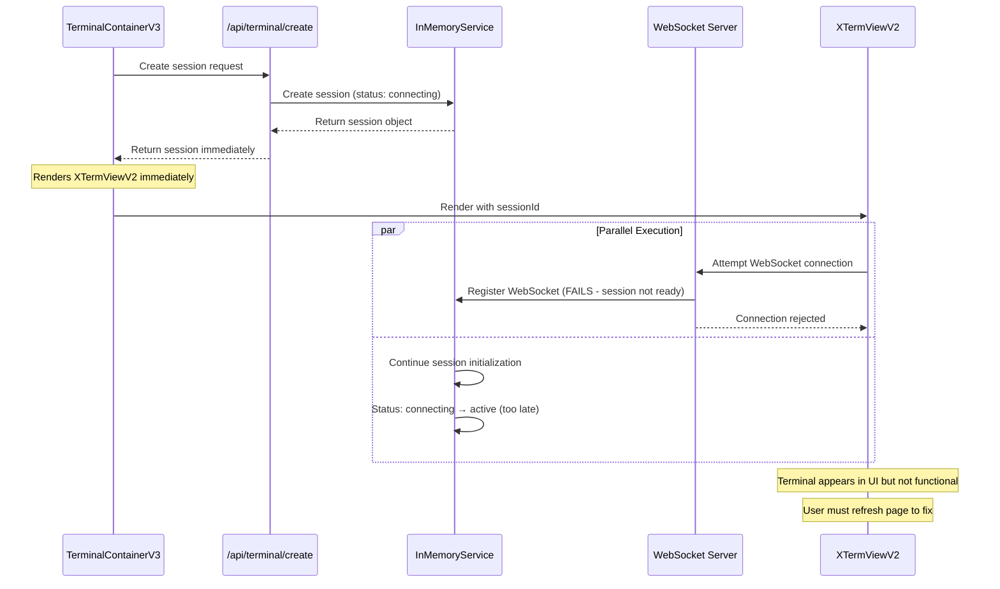
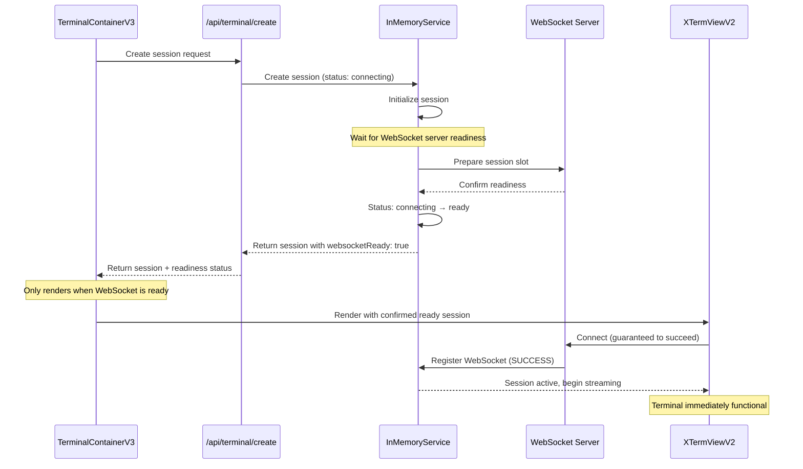
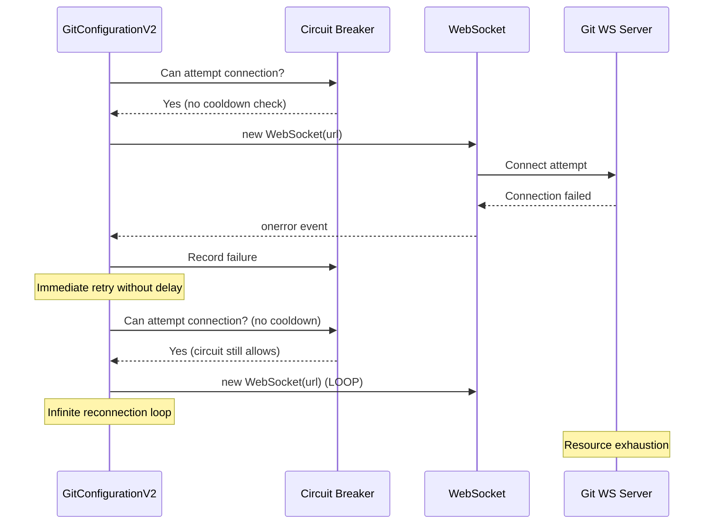
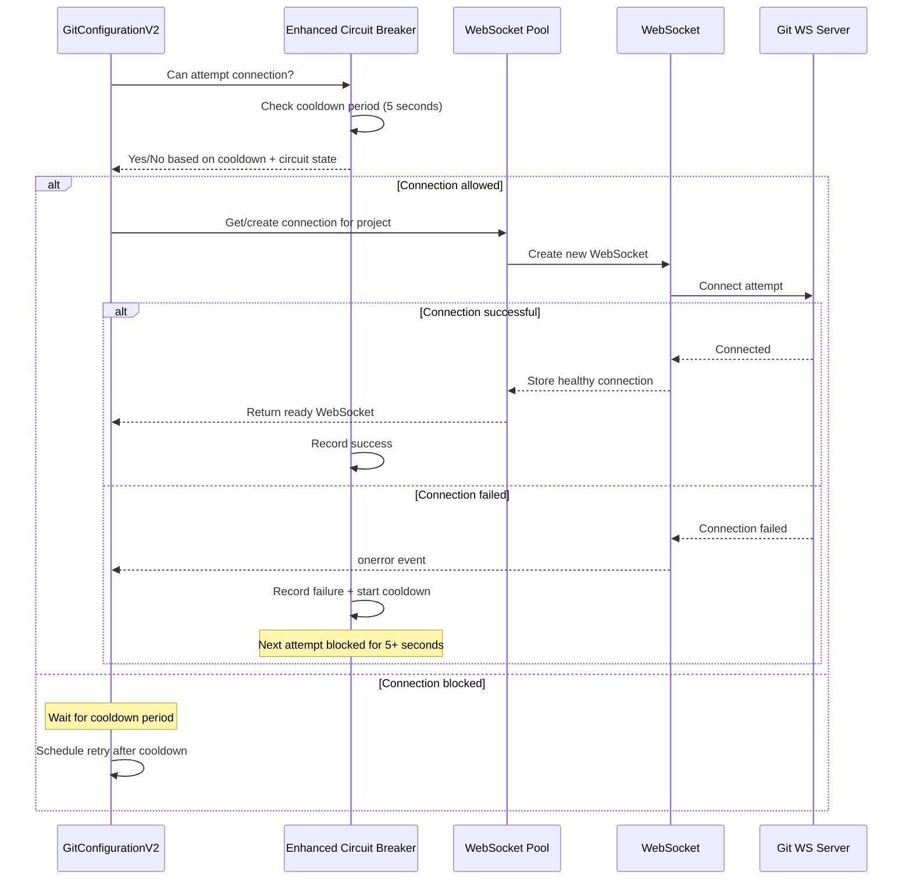
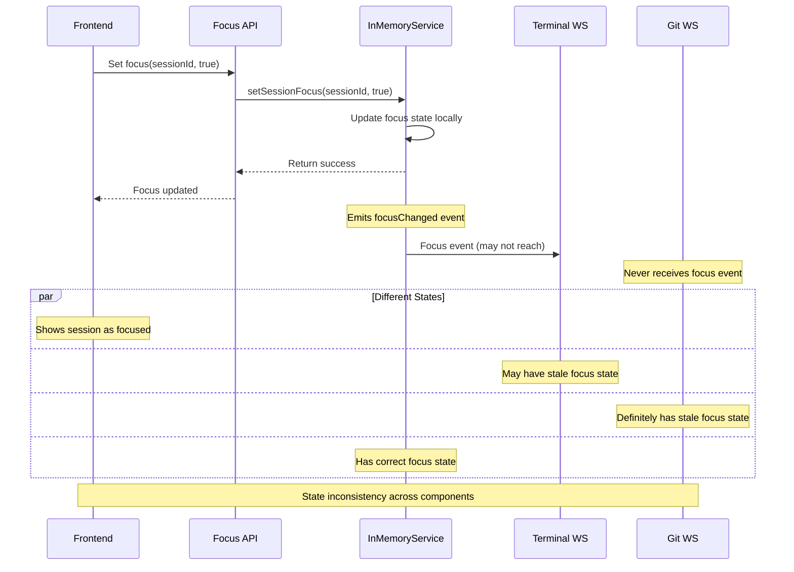
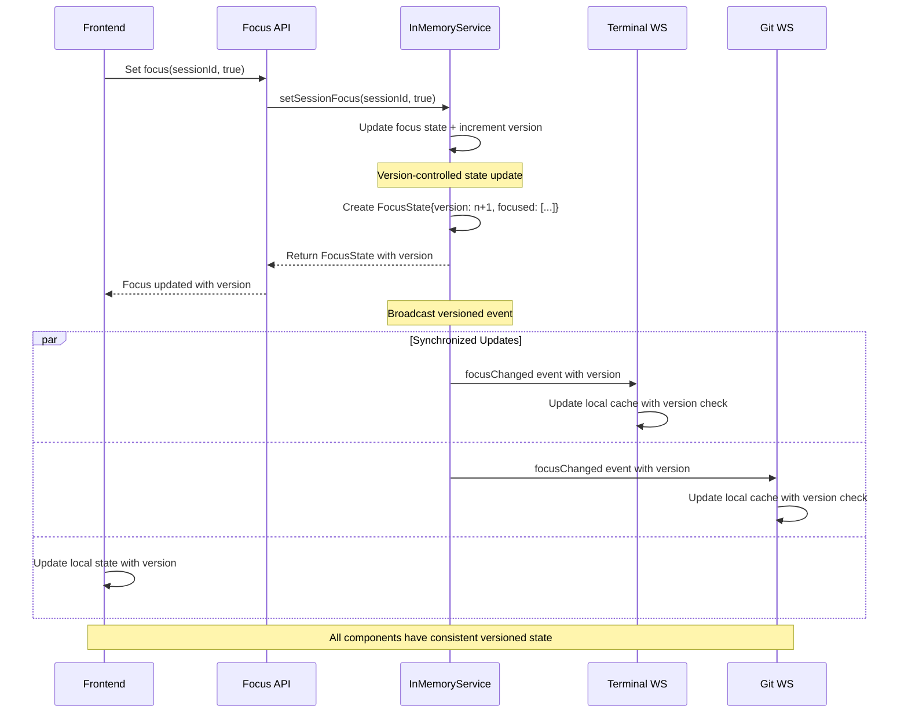
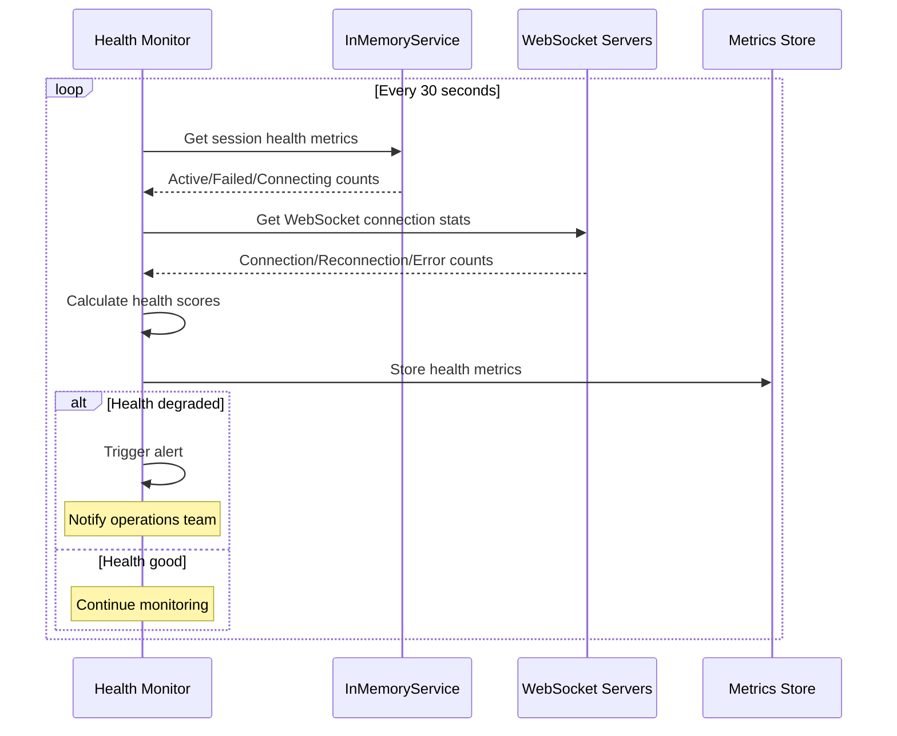
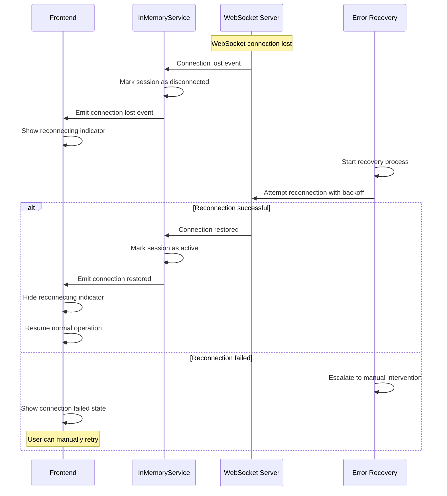

# Workspace Integration Issues - Sequence Diagrams

## Current Problematic Flow (Before Fix)

## Enhanced Solution Flow (After Fix)

## Git WebSocket Loop Issue (Before Fix)

## Enhanced Git WebSocket Flow (After Fix)

## State Synchronization Issue (Before Fix)

## Enhanced State Synchronization (After Fix)

## Integration Health Monitoring

## Error Recovery Flow

---

These sequence diagrams illustrate the complete flow of issues and their solutions in the workspace integration system. The enhanced flows show how proper synchronization, state management, and error handling resolve the critical issues identified in the analysis.