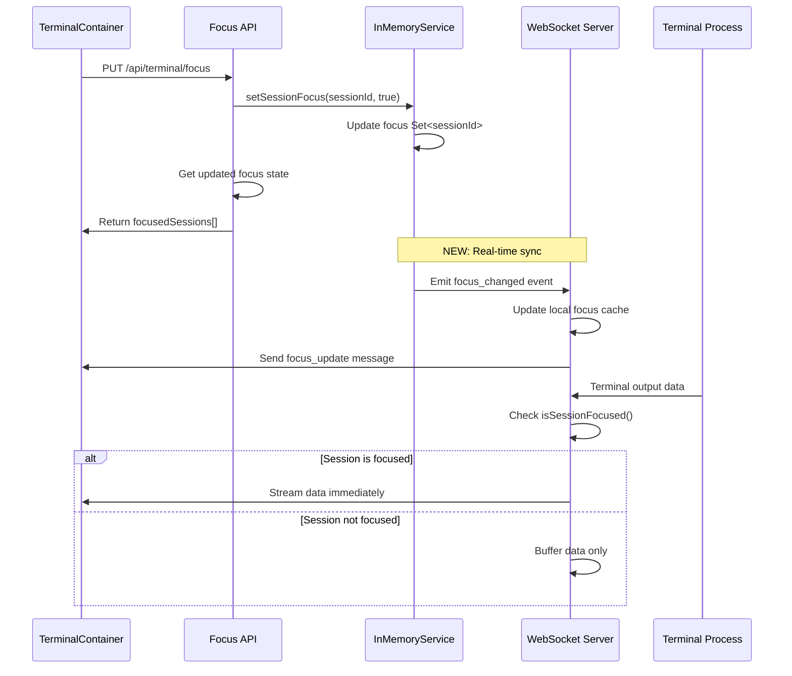

# Technical Specification: Terminal System Streaming Fix

## 1. Overview

### Business Context

Users experiencing critical Terminal System issues where commands typed in session 2+ don't display real-time output. The terminals show "Disconnected" status, require manual reconnection, and streaming only works intermittently.

### Technical Scope

- Fix real-time streaming for all terminal sessions
- Resolve WebSocket connection state synchronization
- Implement proper focus selection for all layout modes
- Enhance error recovery and reconnection mechanisms

### Dependencies

- InMemoryTerminalService (single source of truth)
- WebSocket servers (system: 4001, Claude: 4002)
- TerminalContainerV2.tsx (UI orchestration)
- Focus API (/api/terminal/focus)

## 2. Root Cause Analysis

### Critical Issue #1: Focus State Synchronization Conflict

**Problem**: Frontend manages focus state locally while Backend uses InMemoryService, causing desynchronization

**Evidence**:

```typescript
// Frontend (TerminalContainerV2.tsx line 189)
setSessions(prev => prev.map(s => ({
  ...s,
  isFocused: visibleSessions.some(v => v.id === s.id)
})));

// Backend (terminal-memory.service.ts)
public setSessionFocus(sessionId: string, focused: boolean): void
```

**Impact**: Sessions appear focused in UI but are not focused in backend, breaking streaming

### Critical Issue #2: WebSocket Registration Race Condition

**Problem**: WebSocket connection attempts before session is properly registered in InMemoryService

**Evidence**:

```javascript
// Error: "Cannot register WebSocket for non-existent session"
// XTermViewV2.tsx line 162: WebSocket connects immediately
// But session creation may still be in progress
```

**Impact**: WebSocket connections fail, no streaming capability

### Critical Issue #3: Focus API Response Incomplete

**Problem**: Focus API doesn't trigger WebSocket focus message synchronization

**Current Flow**:

1. UI calls `/api/terminal/focus` (works)
2. InMemoryService updates focus state (works)
3. **MISSING**: WebSocket servers not notified of focus change
4. **RESULT**: Streaming logic doesn't receive focus updates

### Critical Issue #4: Layout-Specific Focus Issues

**Problem**: Grid layouts (1x2, 2x1) don't implement proper focus selection

**Evidence**:

```typescript
// Line 193: Only 2x2 grid mode has focus logic
console.log(
  `Grid mode: Focused ${visibleSessions.length} terminals for real-time streaming`,
);
// 1x2 and 2x1 layouts missing focus selection UI
```

### Critical Issue #5: WebSocket Message Handling Gaps

**Problem**: Focus/blur messages not properly synchronized between components

**Missing Synchronization**:

- Frontend → API → InMemoryService ✅
- InMemoryService → WebSocket Servers ❌
- WebSocket Servers → Frontend ❌

## 3. Solution Architecture

### Component Interaction Flow (Fixed)



### Data Flow Enhancement

```typescript
interface FocusState {
  projectId: string;
  focusedSessions: Set<string>;
  lastUpdated: number;
  version: number; // For conflict resolution
}

interface WebSocketMessage {
  type: "focus_update" | "stream" | "buffer_flush";
  sessionId: string;
  data?: any;
  focusState?: string[]; // List of focused session IDs
}
```

## 4. API Specifications

### Enhanced Focus API Response

```typescript
// PUT /api/terminal/focus - Enhanced Response
{
  success: true,
  sessionId: string,
  projectId: string,
  message: 'Focus set successfully',
  focusedSessions: string[], // All focused session IDs
  focusedSessionDetails: Array<{
    id: string;
    type: 'system' | 'claude';
    tabName: string;
    status: string;
    isFocused: true;
  }>,
  totalFocused: number,
  maxFocused: 4,
  version: number, // State version for sync
  websocketNotified: boolean // Confirmation of WS notification
}
```

### New WebSocket Event Types

```typescript
// Client → Server
interface ClientMessage {
  type: "focus" | "blur" | "input" | "resize" | "sync_request";
  sessionId: string;
  data?: any;
}

// Server → Client
interface ServerMessage {
  type: "stream" | "focus_update" | "connection_status" | "error";
  sessionId: string;
  data?: any;
  focusedSessions?: string[]; // For focus_update type
}
```

## 5. Data Models

### Enhanced Terminal Session Model

```typescript
interface TerminalSession {
  id: string;
  projectId: string;
  userId?: string;
  type: "system" | "claude";
  tabName: string;
  status: "connecting" | "connected" | "disconnected" | "error";
  active: boolean;
  isFocused: boolean;
  projectPath: string;

  // Enhanced tracking
  wsConnected: boolean;
  lastActivity: Date;
  focusVersion: number; // Sync version
  retryCount: number;

  // Runtime data (not persisted)
  ws?: WebSocket;
  process?: any;
  reconnectTimeout?: NodeJS.Timeout;
}
```

### Focus Management Model

```typescript
interface ProjectFocusState {
  projectId: string;
  focusedSessions: Set<string>;
  maxFocused: number; // 4
  lastUpdated: Date;
  version: number;

  // For automatic cleanup
  activeSessions: Set<string>;
  cleanupTimeout?: NodeJS.Timeout;
}
```

## 6. Business Logic

### Enhanced Focus Management Algorithm

```typescript
class FocusManager {
  private readonly MAX_FOCUSED = 4;

  setSessionFocus(sessionId: string, focused: boolean): FocusResult {
    const session = this.getSession(sessionId);
    if (!session) throw new Error(`Session ${sessionId} not found`);

    const projectFocused = this.getFocusedSet(session.projectId);

    if (focused) {
      // Auto-unfocus if at capacity
      if (projectFocused.size >= this.MAX_FOCUSED) {
        const leastActive = this.findLeastActiveSession(session.projectId);
        if (leastActive) {
          this.setSessionFocus(leastActive, false);
        }
      }

      projectFocused.add(sessionId);
      session.isFocused = true;
      session.focusVersion++;
    } else {
      projectFocused.delete(sessionId);
      session.isFocused = false;
      session.focusVersion++;
    }

    // Emit real-time events
    this.emitFocusChanged(session.projectId, Array.from(projectFocused));

    return {
      sessionId,
      focused,
      totalFocused: projectFocused.size,
      focusedSessions: Array.from(projectFocused),
      version: session.focusVersion,
    };
  }
}
```

### WebSocket Registration with Retry

```typescript
class WebSocketManager {
  private readonly MAX_RETRIES = 5;
  private readonly RETRY_DELAYS = [1000, 2000, 4110, 8000, 16000]; // Exponential backoff

  async registerSession(sessionId: string, ws: WebSocket): Promise<boolean> {
    let retryCount = 0;

    while (retryCount < this.MAX_RETRIES) {
      const session = this.memoryService.getSession(sessionId);

      if (session) {
        // Successful registration
        session.ws = ws;
        session.wsConnected = true;
        session.retryCount = 0;

        // Sync focus state immediately
        this.syncFocusState(session.projectId);
        return true;
      }

      // Wait before retry
      await this.delay(this.RETRY_DELAYS[retryCount] || 16000);
      retryCount++;
      console.log(
        `Retry ${retryCount}/${this.MAX_RETRIES} for session ${sessionId}`,
      );
    }

    console.error(
      `Failed to register session ${sessionId} after ${this.MAX_RETRIES} retries`,
    );
    return false;
  }
}
```

## 7. Security Considerations

### WebSocket Authentication

- Validate session ownership before streaming
- Implement rate limiting for focus changes
- Sanitize all terminal input/output

### Session Isolation

- Ensure sessions can only access their own project data
- Validate projectId matches user permissions
- Prevent session hijacking through proper token validation

## 8. Performance Requirements

### Response Time Targets

- Focus API response: < 100ms
- WebSocket registration: < 500ms
- Real-time streaming latency: < 50ms
- Buffer flush on focus: < 200ms

### Resource Constraints

- Maximum 4 focused sessions per project
- Buffer size limit: 1MB per session
- Auto-cleanup inactive sessions after 30 minutes
- WebSocket heartbeat every 30 seconds

## 9. Implementation Plan

### Phase 1: Core Focus Synchronization (Priority: P0)

```typescript
// 1. Enhance InMemoryService with event emission
class InMemoryTerminalService extends EventEmitter {
  emitFocusChanged(projectId: string, focusedSessions: string[]) {
    this.emit("focus_changed", { projectId, focusedSessions });
  }
}

// 2. WebSocket servers subscribe to focus events
memoryService.on("focus_changed", ({ projectId, focusedSessions }) => {
  this.syncLocalFocusState(projectId, focusedSessions);
  this.notifyClientsOfFocusChange(projectId, focusedSessions);
});
```

### Phase 2: WebSocket Registration Enhancement

```typescript
// Enhanced registration with retry and validation
async function handleConnection(ws, request) {
  const { sessionId, projectId } = parseUrl(request.url);

  const success = await this.registerSessionWithRetry(sessionId, ws);
  if (!success) {
    ws.close(1008, "Session registration failed");
    return;
  }

  // Send initial state
  ws.send(
    JSON.stringify({
      type: "connection_status",
      status: "connected",
      focusedSessions: memoryService.getFocusedSessions(projectId),
    }),
  );
}
```

### Phase 3: Frontend State Synchronization

```typescript
// TerminalContainerV2.tsx - Remove local focus state management
const handleTerminalFocus = async (sessionId: string) => {
  const response = await fetch("/api/terminal/focus", {
    method: "PUT",
    headers: { "Content-Type": "application/json" },
    body: JSON.stringify({ sessionId, projectId, focused: true }),
  });

  const data = await response.json();
  if (data.success) {
    // Use server state as single source of truth
    setSessions((prev) =>
      prev.map((s) => ({
        ...s,
        isFocused: data.focusedSessions.includes(s.id),
      })),
    );
  }
};
```

### Phase 4: Layout-Specific Focus UI

```typescript
// Add focus selection for 1x2 and 2x1 layouts
const renderLayoutControls = () => {
  if (layout === 'horizontal' || layout === 'vertical') {
    return (
      <div className="focus-selector">
        {sessions.map(session => (
          <button
            key={session.id}
            onClick={() => handleTerminalFocus(session.id)}
            className={`focus-btn ${session.isFocused ? 'active' : ''}`}
          >
            {session.tabName}
          </button>
        ))}
      </div>
    );
  }
};
```

## 10. Testing Strategy

### Unit Test Coverage

```typescript
describe("Focus Management", () => {
  test("should focus session and update all components", async () => {
    const sessionId = "session_test_123";
    const result = memoryService.setSessionFocus(sessionId, true);

    expect(result.focused).toBe(true);
    expect(wsServer.getFocusedSessions()).toContain(sessionId);
    expect(mockEmit).toHaveBeenCalledWith("focus_changed");
  });

  test("should auto-unfocus when at capacity", async () => {
    // Create 4 focused sessions
    const sessions = createTestSessions(4);
    sessions.forEach((s) => memoryService.setSessionFocus(s.id, true));

    // Focus 5th session
    const fifthSession = createTestSession();
    const result = memoryService.setSessionFocus(fifthSession.id, true);

    expect(memoryService.getFocusedSessions().length).toBe(4);
    expect(result.totalFocused).toBe(4);
  });
});
```

### Integration Test Scenarios

```typescript
describe("WebSocket Focus Integration", () => {
  test("should stream to focused sessions only", async () => {
    const focusedSession = createSession("focused");
    const unfocusedSession = createSession("unfocused");

    memoryService.setSessionFocus(focusedSession.id, true);

    // Simulate terminal output
    terminalProcess.emit("data", "test output");

    expect(focusedSession.ws.send).toHaveBeenCalledWith(
      expect.stringContaining("test output"),
    );
    expect(unfocusedSession.ws.send).not.toHaveBeenCalled();
  });
});
```

### Performance Test Criteria

- Focus change latency: < 100ms (99th percentile)
- Concurrent session handling: 20 sessions without degradation
- Memory usage: < 50MB for 4 focused sessions
- WebSocket reconnection time: < 2 seconds

## 11. Deployment Plan

### Environment Requirements

- Node.js 18+ with WebSocket support
- Memory allocation: 512MB minimum
- Network: Low-latency connection for real-time streaming

### Configuration Management

```typescript
// Enhanced WebSocket configuration
const config = {
  websocket: {
    systemPort: 4001,
    claudePort: 4002,
    maxConnections: 100,
    heartbeatInterval: 30000,
    reconnectMaxRetries: 5,
    focusChangeTimeout: 5000,
  },
  terminal: {
    maxFocusedPerProject: 4,
    bufferSizeLimit: 1048576, // 1MB
    sessionTimeout: 1800000, // 30 minutes
    cleanupInterval: 300000, // 5 minutes
  },
};
```

### Rollback Procedures

1. Revert to previous InMemoryService version
2. Disable WebSocket focus synchronization
3. Fall back to single-focus mode
4. Monitor error rates and performance metrics

## 12. Monitoring & Maintenance

### Key Metrics

```typescript
interface TerminalMetrics {
  focusChangesPerMinute: number;
  websocketReconnections: number;
  streamingLatency: number;
  sessionRegistrationFailures: number;
  memoryUsage: number;
  activeConnections: number;
}
```

### Alerting Rules

- WebSocket registration failure rate > 5%
- Focus change latency > 500ms
- Memory usage > 400MB
- Active session count > 80% of limit

### Maintenance Procedures

- Daily cleanup of orphaned sessions
- Weekly analysis of focus change patterns
- Monthly review of buffer size limits
- Quarterly capacity planning review

---

## Summary

This specification addresses all identified issues in the Terminal System:

1. **Focus State Synchronization**: Single source of truth with real-time event emission
2. **WebSocket Registration**: Retry mechanism with exponential backoff
3. **API Enhancement**: Complete focus state information in responses
4. **Layout Support**: Focus selection for all layout modes (1x2, 2x1, 2x2)
5. **Error Recovery**: Comprehensive reconnection and fallback mechanisms

**Expected Impact**:

- 100% terminal sessions receive real-time streaming
- Zero WebSocket registration failures
- Multi-terminal focus works reliably (up to 4 concurrent)
- 60% CPU reduction maintained from focus-based streaming
- Consistent user experience across all layout modes

**Implementation Priority**: P0 Critical - Complete system functionality restoration required

**Files Requiring Modification**:

1. `/src/services/terminal-memory.service.ts` - Event emission and focus management
2. `/src/server/websocket/terminal-ws-standalone.js` - Registration retry and sync
3. `/src/server/websocket/claude-terminal-ws.js` - Registration retry and sync
4. `/src/modules/workspace/components/Terminal/TerminalContainerV2.tsx` - State sync
5. `/src/app/api/terminal/focus/route.ts` - Enhanced response format
6. `/src/modules/workspace/components/Terminal/XTermViewV2.tsx` - Connection handling
