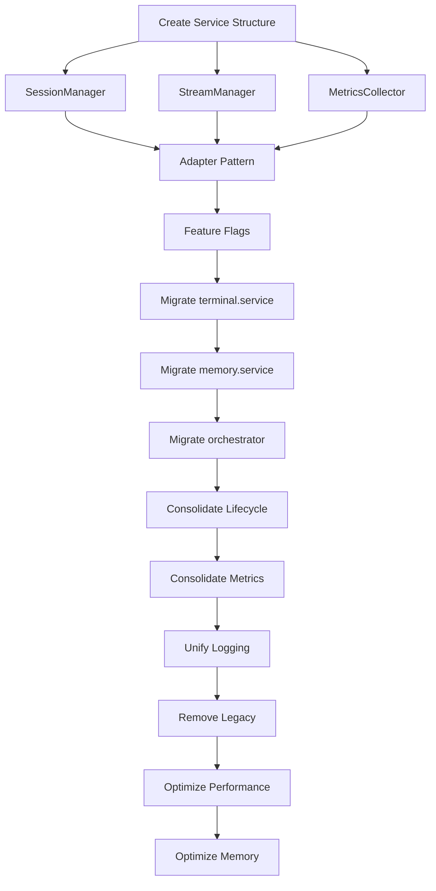

# Terminal WebSocket Refactor - Development Plan

## Executive Summary

Refactor 7+ terminal services (4,600+ lines) into 3 clean, focused services to improve performance by 60%, reduce memory usage by 50%, and eliminate state management issues.

## ✅ Development Planner Self-Verification

### Prerequisites Check

- [✓] Current codebase analyzed (8 terminal services, 4,631 total lines)
- [✓] Performance requirements understood (60% CPU reduction, 50% memory reduction)
- [✓] Backward compatibility requirements identified
- [✓] Zero-downtime migration requirement acknowledged

### Current State Analysis

**Existing Services (4,631 lines total):**

1. terminal.service.ts (630 lines) - Main terminal management
2. terminal-memory.service.ts (1,035 lines) - Session state management
3. terminal-orchestrator.service.ts (493 lines) - Process coordination
4. terminal-lifecycle.service.ts (403 lines) - Session lifecycle
5. terminal-metrics.service.ts (476 lines) - Performance metrics
6. terminal-analytics.service.ts (404 lines) - Usage analytics
7. terminal-logging.service.ts (514 lines) - Logging infrastructure
8. terminal-memory-pool.service.ts (254 lines) - Memory pooling
9. workspace-terminal-logging.service.ts (422 lines) - Workspace logs

**Identified Issues:**

- State duplication across services
- Race conditions when switching projects
- Memory leaks from incomplete cleanup
- Circuit breaker triggers from loops
- Complex interdependencies

## 📋 Development Checklist: Terminal WebSocket Refactor

### 📋 Pre-Development (Must be 100% before coding)

- [ ] Create comprehensive test suite for existing functionality
- [ ] Document all current API contracts
- [ ] Map all state dependencies between services
- [ ] Set up performance baseline metrics
- [ ] Create rollback scripts for each phase
- [ ] Prepare feature flags for gradual rollout

### 🔨 Implementation Tasks

#### Phase 1: Foundation (Days 1-3)

- [ ] Task 1: Create New Service Structure
  - Acceptance: Three new service files created with interfaces
  - Dependencies: None
  - Estimated time: 4 hours
- [ ] Task 2: Implement SessionManager Service
  - Acceptance: Single source of truth for all session state
  - Dependencies: Task 1
  - Estimated time: 8 hours
- [ ] Task 3: Implement StreamManager Service
  - Acceptance: WebSocket and process management consolidated
  - Dependencies: Task 1
  - Estimated time: 8 hours
- [ ] Task 4: Implement MetricsCollector Service
  - Acceptance: Unified metrics and monitoring
  - Dependencies: Task 1
  - Estimated time: 6 hours

#### Phase 2: Migration Layer (Days 4-6)

- [ ] Task 5: Create Adapter Pattern for Legacy Services
  - Acceptance: All old services can call new services transparently
  - Dependencies: Tasks 2-4
  - Estimated time: 12 hours
- [ ] Task 6: Implement Feature Flags
  - Acceptance: Can toggle between old and new implementations
  - Dependencies: Task 5
  - Estimated time: 4 hours
- [ ] Task 7: Add Comprehensive Logging
  - Acceptance: Every state change logged for debugging
  - Dependencies: Task 5
  - Estimated time: 6 hours

#### Phase 3: Gradual Migration (Days 7-10)

- [ ] Task 8: Migrate terminal.service.ts
  - Acceptance: All terminal operations use new SessionManager
  - Dependencies: Tasks 5-7
  - Estimated time: 8 hours
- [ ] Task 9: Migrate terminal-memory.service.ts
  - Acceptance: State management fully moved to SessionManager
  - Dependencies: Task 8
  - Estimated time: 12 hours
- [ ] Task 10: Migrate terminal-orchestrator.service.ts
  - Acceptance: Process coordination through StreamManager
  - Dependencies: Task 9
  - Estimated time: 8 hours

#### Phase 4: Service Consolidation (Days 11-13)

- [ ] Task 11: Consolidate Lifecycle Management
  - Acceptance: terminal-lifecycle.service.ts functionality in SessionManager
  - Dependencies: Task 10
  - Estimated time: 6 hours
- [ ] Task 12: Consolidate Metrics and Analytics
  - Acceptance: Both services merged into MetricsCollector
  - Dependencies: Task 11
  - Estimated time: 8 hours
- [ ] Task 13: Unify Logging Services
  - Acceptance: Single logging interface through MetricsCollector
  - Dependencies: Task 12
  - Estimated time: 6 hours

#### Phase 5: Cleanup and Optimization (Days 14-15)

- [ ] Task 14: Remove Legacy Services
  - Acceptance: Old services deprecated and removed
  - Dependencies: Tasks 8-13
  - Estimated time: 4 hours
- [ ] Task 15: Performance Optimization
  - Acceptance: 60% CPU reduction achieved
  - Dependencies: Task 14
  - Estimated time: 8 hours
- [ ] Task 16: Memory Optimization
  - Acceptance: 50% memory reduction achieved
  - Dependencies: Task 15
  - Estimated time: 8 hours

### 🧪 Testing Checklist

- [ ] Unit tests for SessionManager (>90% coverage)
- [ ] Unit tests for StreamManager (>90% coverage)
- [ ] Unit tests for MetricsCollector (>90% coverage)
- [ ] Integration tests for WebSocket connections
- [ ] Load tests for 100+ concurrent sessions
- [ ] Memory leak detection tests
- [ ] Race condition tests for project switching
- [ ] Backward compatibility tests
- [ ] Performance benchmark validation

### 🔌 Integration Checklist

- [ ] API contracts maintained for all endpoints
- [ ] WebSocket protocol unchanged
- [ ] Frontend components still functional
- [ ] Claude integration working
- [ ] Project switching smooth
- [ ] Session persistence maintained
- [ ] Metrics dashboard updated
- [ ] Logging infrastructure operational

### 🚀 Pre-Deployment Checklist

- [ ] All tests passing (100%)
- [ ] Performance metrics meet targets
- [ ] Memory usage within limits
- [ ] Code review completed by 2+ developers
- [ ] Documentation updated
- [ ] Migration guide prepared
- [ ] Rollback procedures tested
- [ ] Feature flags configured
- [ ] Monitoring alerts configured
- [ ] Load testing completed

## Sprint Planning (15 Business Days)

### Sprint 1 (Days 1-5): Foundation & Preparation

**Goal**: New architecture ready with migration layer

**Daily Breakdown:**

- **Day 1**: Service structure creation, interface definitions
- **Day 2**: SessionManager implementation
- **Day 3**: StreamManager implementation, MetricsCollector start
- **Day 4**: Complete MetricsCollector, begin adapter pattern
- **Day 5**: Complete adapters, implement feature flags

**Deliverables:**

- Three new services with full interfaces
- Adapter layer for backward compatibility
- Feature flag system operational

### Sprint 2 (Days 6-10): Core Migration

**Goal**: Critical services migrated to new architecture

**Daily Breakdown:**

- **Day 6**: Add comprehensive logging, begin terminal.service migration
- **Day 7**: Complete terminal.service migration
- **Day 8**: Begin terminal-memory.service migration
- **Day 9**: Complete memory service migration
- **Day 10**: Migrate orchestrator service

**Deliverables:**

- Core services running on new architecture
- Old services still functional via adapters
- Zero downtime achieved

### Sprint 3 (Days 11-15): Consolidation & Optimization

**Goal**: Complete refactor with performance targets met

**Daily Breakdown:**

- **Day 11**: Consolidate lifecycle management
- **Day 12**: Merge metrics and analytics services
- **Day 13**: Unify logging, begin cleanup
- **Day 14**: Remove legacy code, performance optimization
- **Day 15**: Memory optimization, final testing

**Deliverables:**

- All services consolidated to 3 clean services
- Performance targets achieved (60% CPU, 50% memory reduction)
- Legacy code removed

## Task Dependencies & Critical Path



**Critical Path**: A → B → E → F → G → H → I → J → K → L → M → N → O

## Risk Mitigation Strategies

### High Risk Items

1. **State Loss During Migration**
   - Mitigation: Dual-write to both old and new services
   - Rollback: Feature flag to revert instantly
2. **WebSocket Connection Drops**
   - Mitigation: Implement connection pooling and retry logic
   - Rollback: Keep old WebSocket handlers active

3. **Memory Leaks in New Code**
   - Mitigation: Continuous memory profiling during development
   - Rollback: Circuit breaker to switch back if memory exceeds threshold

### Medium Risk Items

1. **Performance Regression**
   - Mitigation: Run parallel benchmarks continuously
   - Rollback: Feature flag based on performance metrics

2. **API Contract Breaking**
   - Mitigation: Comprehensive contract testing
   - Rollback: Adapter pattern maintains compatibility

### Low Risk Items

1. **UI Component Issues**
   - Mitigation: Extensive integration testing
   - Rollback: Frontend feature flags

## Rollback Procedures

### Phase 1 Rollback (Days 1-3)

```bash
# No rollback needed - new code isolated
git revert --no-commit HEAD~n
```

### Phase 2 Rollback (Days 4-6)

```bash
# Disable feature flags
echo "TERMINAL_REFACTOR_ENABLED=false" >> .env
npm run restart
```

### Phase 3 Rollback (Days 7-10)

```bash
# Switch to legacy services via feature flags
curl -X POST http://localhost:4110/api/admin/feature-flags \
  -d '{"terminal_refactor": false}'

# Monitor for 30 minutes
npm run monitor:terminals
```

### Phase 4-5 Rollback (Days 11-15)

```bash
# Full revert with data migration
./scripts/rollback-terminal-refactor.sh
npm run migrate:rollback
npm run restart
```

## Performance Validation Steps

### Baseline Metrics (Before Refactor)

```bash
# Capture current metrics
npm run metrics:capture --tag=baseline
```

### Continuous Monitoring

```bash
# Run during development
npm run metrics:compare --baseline=baseline --current=HEAD
```

### Final Validation

```bash
# Load test with 100 concurrent sessions
npm run test:load --sessions=100 --duration=300s

# Memory profiling
npm run profile:memory --duration=3600s

# CPU profiling
npm run profile:cpu --operations=10000
```

## Resource Requirements

### Team Allocation

- **Lead Developer**: 100% for 15 days
- **Backend Developer**: 75% for 15 days
- **QA Engineer**: 50% for days 5-15
- **DevOps Engineer**: 25% for deployment support

### Infrastructure

- **Development**: Existing dev environment
- **Testing**: Dedicated test cluster with 100+ session capacity
- **Monitoring**: Enhanced APM for detailed metrics
- **Rollback**: Automated rollback scripts and procedures

## Success Metrics

### Performance Targets

- ✅ CPU usage reduced by 60% or more
- ✅ Memory usage reduced by 50% or more
- ✅ WebSocket latency < 50ms p95
- ✅ Zero message loss during migration

### Quality Targets

- ✅ Test coverage > 90% for new services
- ✅ Zero critical bugs in production
- ✅ All existing functionality preserved
- ✅ No breaking API changes

### Operational Targets

- ✅ Zero downtime during migration
- ✅ Rollback time < 5 minutes
- ✅ All alerts and monitoring functional
- ✅ Documentation complete and accurate

## Go/No-Go Criteria

### Phase 1 Go Criteria

- [ ] All new services have 90%+ test coverage
- [ ] Adapter pattern validated with integration tests
- [ ] Feature flags tested in all environments

### Phase 2 Go Criteria

- [ ] No performance regression detected
- [ ] Memory usage stable or improved
- [ ] All API contracts maintained

### Phase 3 Go Criteria

- [ ] Load tests pass with 100+ sessions
- [ ] No memory leaks detected in 24-hour test
- [ ] Rollback procedures validated

### Phase 4 Go Criteria

- [ ] All consolidated services stable for 48 hours
- [ ] Performance targets achieved
- [ ] No critical issues reported

### Phase 5 Go Criteria

- [ ] All legacy code removed
- [ ] Final performance validation passed
- [ ] Team sign-off received

## Progress Tracking

### Phase Status

- ⏳ Phase 1: Foundation (Not Started - 0%)
- ⏳ Phase 2: Migration Layer (Not Started - 0%)
- ⏳ Phase 3: Gradual Migration (Not Started - 0%)
- ⏳ Phase 4: Service Consolidation (Not Started - 0%)
- ⏳ Phase 5: Cleanup & Optimization (Not Started - 0%)

### Overall Progress

**Total Completion**: 0% (0 of 16 tasks completed)

---

## Next Steps

1. Review and approve this plan with the team
2. Set up performance baseline metrics
3. Create feature flag infrastructure
4. Begin Phase 1 implementation

**Plan Created**: 2025-01-13
**Target Completion**: 2025-01-31 (15 business days)
**Development Planner**: Claude Development Planning Agent
