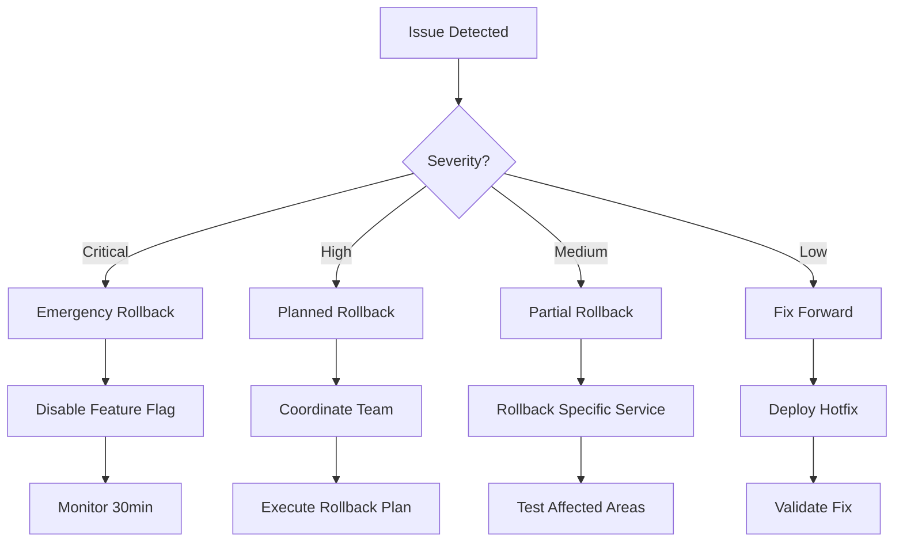

# Terminal WebSocket Refactor - Rollback Procedures

## Quick Rollback Commands

### EMERGENCY ROLLBACK (< 30 seconds)
```bash
# Immediate rollback via feature flag
curl -X POST http://localhost:4000/api/admin/feature-flags \
  -H "Content-Type: application/json" \
  -d '{"terminal_refactor": false, "force": true}'

# Restart services
./quick-restart.sh

# Verify rollback
curl http://localhost:4000/api/health/terminal
```

## Rollback Decision Tree



## Phase-Specific Rollback Procedures

### Phase 1: Foundation (Days 1-3)
**Risk Level**: LOW
**Rollback Time**: < 5 minutes
**Data Impact**: None

```bash
# Simply remove new files - no integration yet
rm -rf /src/services/refactored/
git checkout -- .
npm run restart
```

**Validation**:
- [ ] New services removed
- [ ] No impact on existing services
- [ ] All terminals functional

### Phase 2: Migration Layer (Days 4-6)
**Risk Level**: MEDIUM
**Rollback Time**: < 10 minutes
**Data Impact**: None

```bash
# Disable feature flags
echo "TERMINAL_REFACTOR_ENABLED=false" >> .env
echo "TERMINAL_DUAL_WRITE=false" >> .env

# Restart services
npm run restart

# Clear adapter cache
redis-cli FLUSHDB

# Validate terminals
npm run test:terminals
```

**Validation**:
- [ ] Feature flags disabled
- [ ] Adapters bypassed
- [ ] Original services active
- [ ] No performance degradation

### Phase 3: Gradual Migration (Days 7-10)
**Risk Level**: HIGH
**Rollback Time**: < 15 minutes
**Data Impact**: Possible state loss

```bash
#!/bin/bash
# rollback-phase3.sh

echo "Starting Phase 3 Rollback..."

# 1. Stop new connections
curl -X POST http://localhost:4000/api/admin/maintenance/enable

# 2. Export current state
node scripts/export-terminal-state.js > terminal-state-backup.json

# 3. Disable refactored services
curl -X POST http://localhost:4000/api/admin/feature-flags \
  -d '{"terminal_refactor": false}'

# 4. Restore legacy service state
node scripts/restore-legacy-state.js < terminal-state-backup.json

# 5. Restart services
systemctl restart terminal-service

# 6. Validate connections
for i in {1..10}; do
  curl -s http://localhost:4000/api/health/terminal || exit 1
  sleep 1
done

# 7. Re-enable connections
curl -X POST http://localhost:4000/api/admin/maintenance/disable

echo "Rollback complete"
```

**Validation**:
- [ ] All sessions restored
- [ ] No data loss
- [ ] WebSocket connections stable
- [ ] Performance baseline restored

### Phase 4: Service Consolidation (Days 11-13)
**Risk Level**: HIGH
**Rollback Time**: 20-30 minutes
**Data Impact**: State migration required

```bash
#!/bin/bash
# rollback-phase4.sh

set -e

echo "Starting Phase 4 Rollback..."
echo "This will restore all legacy services"

# 1. Create rollback checkpoint
pg_dump $DATABASE_URL > rollback-checkpoint.sql

# 2. Stop all terminal operations
docker-compose stop terminal-service

# 3. Restore legacy services from backup
git checkout rollback/pre-consolidation -- src/services/terminal-*.service.ts

# 4. Restore database schema
psql $DATABASE_URL < migrations/rollback-terminal-v2.sql

# 5. Migrate data back to legacy format
node scripts/migrate-to-legacy.js \
  --source=terminal_sessions_v2 \
  --target=terminal_sessions

# 6. Rebuild services
npm run build

# 7. Start services with legacy configuration
TERMINAL_LEGACY_MODE=true npm run start

# 8. Validate all services
npm run test:integration:terminal

# 9. Monitor for 15 minutes
npm run monitor:terminals --duration=900
```

**Validation**:
- [ ] All 7 legacy services running
- [ ] Data migrated successfully
- [ ] No session loss
- [ ] Metrics collection working
- [ ] Logging operational

### Phase 5: Cleanup (Days 14-15)
**Risk Level**: CRITICAL
**Rollback Time**: 30-60 minutes
**Data Impact**: Full restoration required

```bash
#!/bin/bash
# emergency-full-rollback.sh

set -e

echo "EMERGENCY FULL ROLLBACK INITIATED"
echo "This will completely restore the pre-refactor state"

# 1. Alert team
curl -X POST $SLACK_WEBHOOK -d '{"text": "EMERGENCY: Terminal refactor rollback initiated"}'

# 2. Enable maintenance mode
curl -X POST http://localhost:4000/api/admin/maintenance/enable \
  -d '{"message": "System maintenance in progress", "eta": "60 minutes"}'

# 3. Backup current state (even if broken)
mkdir -p backups/emergency-$(date +%Y%m%d-%H%M%S)
pg_dump $DATABASE_URL > backups/emergency-$(date +%Y%m%d-%H%M%S)/database.sql
tar -czf backups/emergency-$(date +%Y%m%d-%H%M%S)/code.tar.gz src/

# 4. Stop all services
docker-compose down

# 5. Restore from last known good backup
git fetch origin
git checkout $LAST_STABLE_COMMIT

# 6. Restore database
psql $DATABASE_URL < backups/last-known-good/database.sql

# 7. Clean build
rm -rf node_modules dist .next
npm ci
npm run build

# 8. Start services
docker-compose up -d

# 9. Run smoke tests
npm run test:smoke

# 10. Gradual traffic restoration
for percent in 10 25 50 75 100; do
  echo "Restoring ${percent}% traffic"
  curl -X POST http://localhost:4000/api/admin/traffic \
    -d "{\"percentage\": $percent}"
  sleep 300  # Wait 5 minutes between increases
  
  # Check error rate
  ERROR_RATE=$(curl -s http://localhost:4000/api/metrics/errors | jq .rate)
  if (( $(echo "$ERROR_RATE > 1.0" | bc -l) )); then
    echo "Error rate too high: $ERROR_RATE"
    exit 1
  fi
done

# 11. Disable maintenance mode
curl -X POST http://localhost:4000/api/admin/maintenance/disable

echo "Rollback complete. System restored to pre-refactor state."
```

## Rollback Validation Checklist

### Immediate Checks (< 5 minutes)
- [ ] All terminals can connect
- [ ] Existing sessions preserved
- [ ] No WebSocket errors
- [ ] API endpoints responding
- [ ] No memory leaks

### Short-term Monitoring (30 minutes)
- [ ] CPU usage normal
- [ ] Memory stable
- [ ] No error spikes
- [ ] Session creation working
- [ ] Project switching smooth

### Extended Validation (24 hours)
- [ ] No performance degradation
- [ ] All features functional
- [ ] No data corruption
- [ ] Metrics accurate
- [ ] No customer complaints

## Data Recovery Procedures

### Session State Recovery
```javascript
// recover-sessions.js
const { SessionManager } = require('./src/services/terminal-memory.service');
const backup = require('./terminal-state-backup.json');

async function recoverSessions() {
  for (const session of backup.sessions) {
    try {
      await SessionManager.restoreSession(session);
      console.log(`Recovered session: ${session.id}`);
    } catch (error) {
      console.error(`Failed to recover session ${session.id}:`, error);
    }
  }
}

recoverSessions();
```

### WebSocket Connection Recovery
```javascript
// recover-connections.js
const WebSocket = require('ws');
const connections = require('./connection-backup.json');

async function recoverConnections() {
  for (const conn of connections) {
    const ws = new WebSocket(`ws://localhost:4001/terminal/${conn.sessionId}`);
    ws.on('open', () => {
      console.log(`Reconnected session: ${conn.sessionId}`);
    });
  }
}
```

## Monitoring During Rollback

### Key Metrics to Watch
```bash
# Terminal sessions
watch -n 1 'curl -s http://localhost:4000/api/metrics/terminals | jq .'

# Memory usage
watch -n 1 'ps aux | grep node | head -5'

# Error rate
watch -n 1 'tail -20 /var/log/terminal-error.log | grep ERROR | wc -l'

# WebSocket connections
watch -n 1 'netstat -an | grep :4001 | grep ESTABLISHED | wc -l'
```

### Alert Thresholds
- **CPU > 80%**: Investigate immediately
- **Memory > 2GB**: Potential memory leak
- **Error rate > 1%**: Rollback recommended
- **Session loss > 0**: Critical - immediate rollback
- **Response time > 500ms**: Performance degraded

## Communication Plan

### Internal Communication
```bash
# Slack notification
curl -X POST $SLACK_WEBHOOK -d @- << EOF
{
  "text": "Terminal Refactor Rollback Initiated",
  "attachments": [{
    "color": "danger",
    "fields": [
      {"title": "Phase", "value": "$ROLLBACK_PHASE", "short": true},
      {"title": "Reason", "value": "$ROLLBACK_REASON", "short": true},
      {"title": "ETA", "value": "$ROLLBACK_ETA", "short": true},
      {"title": "Impact", "value": "$ROLLBACK_IMPACT", "short": true}
    ]
  }]
}
EOF
```

### Customer Communication
Only if customer-facing impact:
1. Update status page
2. Send email to affected users
3. Post in-app notification
4. Update support team

## Post-Rollback Actions

### Immediate (Within 1 hour)
1. [ ] Confirm system stability
2. [ ] Document rollback reason
3. [ ] Preserve logs for analysis
4. [ ] Update team on status

### Short-term (Within 24 hours)
1. [ ] Root cause analysis
2. [ ] Update rollback procedures
3. [ ] Plan remediation
4. [ ] Schedule retry

### Long-term (Within 1 week)
1. [ ] Implement fixes
2. [ ] Enhanced testing
3. [ ] Update documentation
4. [ ] Lessons learned session

## Rollback Test Plan

### Pre-Production Testing
```bash
# Test rollback in staging
./scripts/test-rollback.sh --env=staging --phase=3

# Validate rollback time
time ./scripts/rollback-phase3.sh

# Test data recovery
./scripts/test-data-recovery.sh
```

### Rollback Dry Run
Every Friday at 3 PM (low traffic):
1. Enable maintenance window
2. Execute rollback procedure
3. Validate system state
4. Roll forward
5. Document timing

## Emergency Contacts

### Escalation Path
1. **On-Call Engineer**: Check PagerDuty
2. **Team Lead**: via Slack #terminal-team
3. **DevOps**: via Slack #devops
4. **Manager**: If customer impact > 10 minutes

### External Dependencies
- **Database Team**: For data recovery assistance
- **Infrastructure**: For resource scaling
- **Security**: If any security concerns
- **Customer Success**: For customer communication

---

## Quick Reference Card

### 🚨 EMERGENCY COMMANDS
```bash
# STOP EVERYTHING
docker-compose down

# DISABLE REFACTOR
echo "TERMINAL_REFACTOR_ENABLED=false" >> .env

# RESTART LEGACY
TERMINAL_LEGACY_MODE=true npm run start

# CHECK STATUS
curl http://localhost:4000/api/health/terminal
```

### 📊 Key Metrics Commands
```bash
# Session count
curl http://localhost:4000/api/metrics/terminals/sessions

# Error rate
curl http://localhost:4000/api/metrics/terminals/errors

# Memory usage
curl http://localhost:4000/api/metrics/terminals/memory
```

### 📞 Emergency Contacts
- On-Call: [PagerDuty](https://company.pagerduty.com)
- Slack: #terminal-emergency
- Phone: [Escalation List]

---

**Document Created**: 2025-01-13
**Last Updated**: 2025-01-13
**Document Owner**: DevOps Team
**Review Schedule**: Before each rollback phase