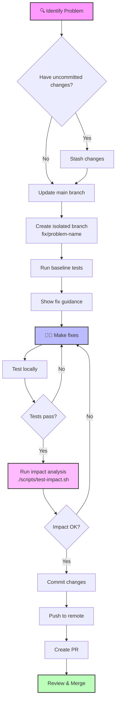

# 🔄 Isolated Fix Workflow Diagram

## Visual Workflow



## 📊 Command Flow

### 1️⃣ Start Fix

```bash
./scripts/isolate-fix.sh fix-contact-page "Create missing contact page"
```

↓

### 2️⃣ System Creates

```
✅ Stashes current work (if any)
✅ Updates main branch
✅ Creates branch: fix/fix-contact-page
✅ Runs baseline tests
✅ Shows specific guidance
✅ Creates tracking file
```

↓

### 3️⃣ You Work

```bash
# Make your changes
mkdir -p src/app/(public)/contact
vi src/app/(public)/contact/page.tsx

# Test locally
npm run dev
curl http://localhost:3100/contact
```

↓

### 4️⃣ Check Impact

```bash
./scripts/test-impact.sh
```

↓

### 5️⃣ Review Results

```
📊 IMPACT SUMMARY
✅ No negative impact detected!
Your changes appear to be safe.
```

↓

### 6️⃣ Commit & Push

```bash
git add .
git commit -m "fix(contact): create missing contact page"
git push -u origin fix/fix-contact-page
```

## 🎯 Decision Points

### When to Create New Branch?

```
┌─────────────────────┐
│ New Problem Found?  │
└──────────┬──────────┘
           │
           ▼
    ┌──────────────┐
    │ Same module? │───No──→ Create new branch
    └──────┬───────┘
           │Yes
           ▼
    ┌──────────────┐
    │ Quick fix?   │───No──→ Create new branch
    └──────┬───────┘
           │Yes
           ▼
    Continue in current branch
```

### When to Merge?

```
All checks must pass:
□ Local tests pass
□ TypeScript clean
□ Impact analysis OK
□ Build successful
□ PR approved
↓
✅ Safe to merge!
```

## 🔍 Problem Types & Solutions

### Type 1: Missing Pages (404)

```bash
Problem: /contact returns 404
↓
./scripts/isolate-fix.sh fix-contact-page
↓
Create: src/app/(public)/contact/page.tsx
↓
Test: curl http://localhost:3100/contact
```

### Type 2: API Security

```bash
Problem: API not protected
↓
./scripts/isolate-fix.sh fix-api-security
↓
Add: withApiMiddleware wrapper
↓
Test: API with/without auth token
```

### Type 3: TypeScript Errors

```bash
Problem: Type errors in module
↓
./scripts/isolate-fix.sh fix-module-types
↓
Fix: Add proper types/interfaces
↓
Test: npx tsc --noEmit
```

## 📈 Progress Tracking

### Daily Workflow

```
Morning:
├── Check system status
├── Review yesterday's fixes
└── Plan today's fixes

Working:
├── Create isolated branch
├── Make focused changes
├── Test thoroughly
└── Check impact

Evening:
├── Commit completed fixes
├── Update tracking
└── Plan tomorrow
```

### Weekly Review

```
Monday:
└── Review all fix/* branches

Wednesday:
└── Merge completed fixes

Friday:
├── Clean up merged branches
└── Update documentation
```

## 🚀 Quick Reference Card

```bash
# CREATE FIX BRANCH
./scripts/isolate-fix.sh [name] "[description]"

# CHECK WHAT YOU CHANGED
git status
git diff

# TEST YOUR CHANGES
npm test -- --findRelatedTests [file]
./scripts/test-impact.sh

# COMMIT WHEN READY
git add .
git commit -m "fix(area): description"
git push -u origin fix/[name]

# CREATE PR
gh pr create
```

## 🎨 Color Codes in Scripts

- 🟣 **Purple**: Section headers
- 🔵 **Blue**: Information
- 🟡 **Yellow**: Warnings/Actions
- 🟢 **Green**: Success
- 🔴 **Red**: Errors/Failed

## 💡 Pro Tips

1. **Name branches clearly**

   ```
   ✅ fix/missing-contact-page
   ✅ fix/api-auth-posts
   ❌ fix/stuff
   ❌ fix/temp
   ```

2. **One fix per branch**

   ```
   ✅ Fix only contact page
   ❌ Fix contact + search + API
   ```

3. **Test incrementally**

   ```
   Change → Test → Change → Test
   Not: Change everything → Test once
   ```

4. **Use tracking files**
   ```bash
   cat .fix-tracking/fix-contact-page.md
   # Update with your progress
   ```

---

**Golden Rule**: If you're unsure about impact, run `./scripts/test-impact.sh` 🎯
